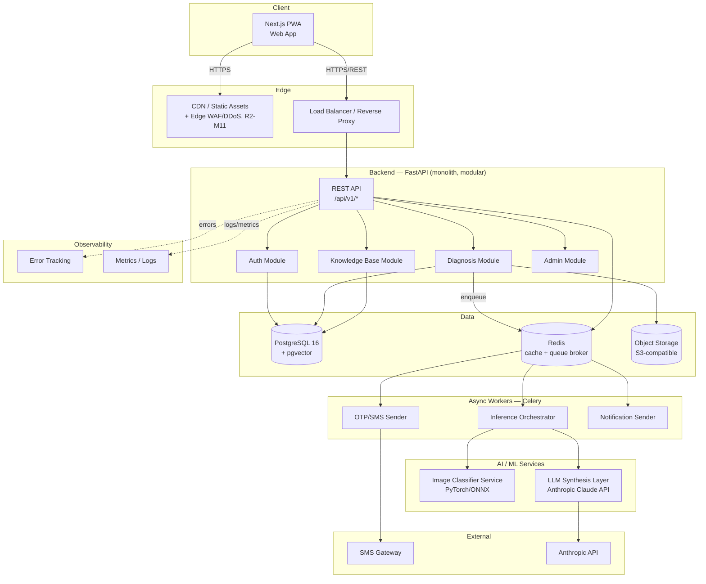
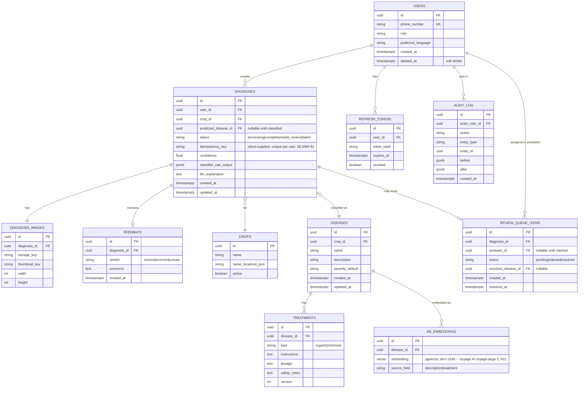
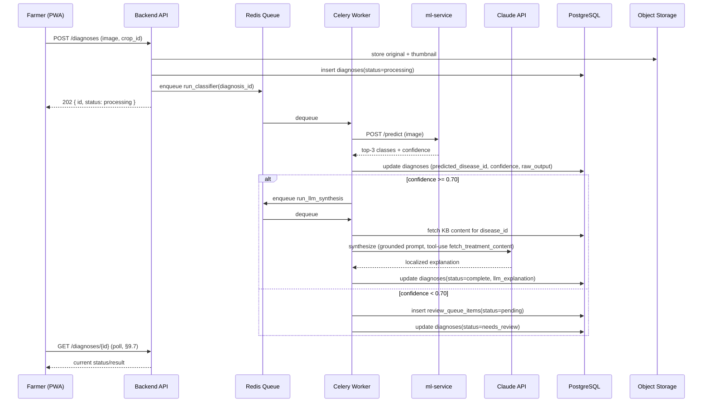

# CropGuard AI — Software Requirements Specification & Technical Architecture

**Document type:** Production SRS + Architecture (implementation-ready)
**Primary interface (v1):** Web application (PWA-capable)
**Primary users (v1):** Smallholder farmers
**Roadmap:** Native mobile app (Phase 2), WhatsApp/Telegram bot (Phase 3) — see §17–18
**Status:** Draft v1.0

> **Assumption ledger (A1–A13), referenced throughout:**
> - **A1** — Project name "CropGuard AI" is a placeholder; rename before build.
> - **A2** — Target crops v1: tomato, potato, maize, rice, wheat, cotton, chili (PlantVillage-dataset-aligned; swap per actual deployment region).
> - **A3** — Languages v1: English + Hindi, via i18n framework so more can be added without code changes.
> - **A4** — Farmers authenticate via phone number + OTP (no email required), because email adoption is unreliable in this user segment.
> - **A5** — No payment/monetization in v1 (diagnosis is free); monetization deferred to §18.
> - **A6** — Low-confidence diagnoses (<70%) are routed to a human agronomist review queue rather than shown as authoritative — this is a safety requirement, not a nice-to-have (wrong pesticide guidance causes real harm).
> - **A7** — Treatment/dosage text is never LLM-generated from parametric memory; it is retrieved from a vetted internal knowledge base (RAG) and the LLM only rephrases/localizes it. See §11.
> - **A8** — Deployment region has intermittent/low-bandwidth connectivity (2G/3G); this drives frontend and API design throughout.
> - **A9** — No formal regulatory compliance (e.g., HIPAA/PCI) applies; standard data-protection best practice (GDPR-style principles) is applied voluntarily, not as a compliance claim.
> - **A10** — Identity is per-phone-number, not per-person: a shared household phone means a shared account/history. This is a deliberate v1 scope decision, not an oversight — a profile-switcher-under-one-OTP-session is a reasonable Phase 2 addition (§18) if household-sharing turns out to cause real confusion in practice, but is not built now.
> - **A11** — Embeddings provider is **Voyage AI** (`voyage-large-2`, 1536-dim, matching `kb_embeddings.embedding` in §8.1) — Anthropic does not offer a native embeddings endpoint, so a separate provider is required (Voyage is Anthropic's own recommended pairing). See §11.3, §16.1.
> - **A12** — "Lost/changed phone number" account recovery is explicitly **out of self-serve scope for v1**: it requires manual support-assisted verification (not specified further here — an ops process, not a code deliverable). Documented as a known gap rather than left silent.
> - **A13** — First-login includes a single non-blocking consent screen (data-use-for-model-improvement notice + ToS acceptance) before the farmer's first diagnosis — added to close a privacy gap the original draft left implicit. See §3.1, §13.6.

---

## 1. Executive Summary

### 1.1 Vision
A farmer photographs a diseased crop leaf on a low-end Android phone with a web browser, and within seconds receives a plain-language diagnosis, a confidence-scored explanation, and a grounded treatment recommendation (organic and chemical options) in their own language — without needing to wait for an extension officer to visit in person.

### 1.2 Problem Statement
Smallholder farmers lose 20–40% of crop yield annually to disease (FAO estimate — general industry figure, not project-specific data), and in-person agronomist access is scarce and slow. Farmers often misidentify disease and either over-apply pesticide (cost, environmental/health harm) or apply the wrong treatment entirely.

### 1.3 Goals (v1)
- G1: Diagnose the 5–10 most common diseases per supported crop (A2) from a single photo with actionable output in <10s end-to-end.
- G2: Never present a low-confidence guess as certain — route to human review instead (A6).
- G3: Function usably on 3G with a 2MP photo upload (A8).
- G4: Ship in the farmer's own language (A3).
- G5: Capture every diagnosis + outcome as training/eval data for continuous model improvement.

### 1.4 Non-Goals (v1)
- NG1: Not a general farm-management platform (no weather, no market prices, no bookkeeping).
- NG2: Not a pesticide marketplace/e-commerce (deferred, §18).
- NG3: Not multi-tenant/white-label (deferred, §18 — though DB is designed to not block it, see §8).
- NG4: Not a replacement for a licensed agronomist in high-stakes/high-value-crop decisions — product copy must say so explicitly (legal/liability consideration, see §13).
- **Confirmed scope check against the competitive category (fix, R2 competitive-benchmarking note):** established disease-ID products in this space commonly bundle pest/nutrient-deficiency identification, weather, a fertilizer calculator, and community/forum features around the core diagnosis flow. NG1/NG2 above are a **deliberate "not yet," not an unconsidered gap** — confirmed here explicitly rather than left for a reader to guess whether the narrower scope was a choice or an oversight. One specific consequence of the narrower scope is called out as an accepted risk rather than silently ignored: nutrient-deficiency symptoms visually resemble disease symptoms, and the v1 classifier taxonomy (§11.2) has no deficiency class — see §11.2's explicit note on this residual failure mode.

### 1.5 Competitive Advantage
- Hybrid classifier + RAG-grounded LLM (§11) avoids the two common failure modes of competitors: pure black-box classifiers (no explanation, no trust) and pure LLM chat tools (hallucinated treatment advice).
- Human-in-the-loop review queue (A6) is a trust and safety differentiator, not just a technical detail.
- PWA-first web app removes app-store friction and works on any phone with a browser, before mobile/WhatsApp channels exist (A8).

### 1.6 Success Metrics
| Metric | Target (v1, 6 months post-launch) |
|---|---|
| Diagnosis-to-result latency (p95) | < 8s |
| Classifier top-1 accuracy (held-out test set) | > 80% per supported disease class |
| % diagnoses routed to human review | **5–25% target range**, not a bare ceiling — below 5% is as much a warning sign (confidence threshold likely miscalibrated / too permissive, §11.8) as above 25% (model not useful) |
| Farmer-confirmed-correct rate (feedback loop) | > 75% |
| Weekly active farmers | Business metric — no baseline exists; instrument only, no target claimed |

---

## 2. Product Requirements

### 2.1 Personas
- **P1 — Amara, smallholder farmer (primary).** Grows tomato + maize on <2 hectares. Android phone, patchy 3G, moderate literacy, comfortable with WhatsApp but new to web apps. Wants: fast answer, doesn't want to create an account with a password she'll forget.
- **P2 — Raj, agronomist reviewer (internal user, v1 minimal).** Reviews low-confidence cases via a lightweight internal queue. Not a public-facing persona.
- **P3 — Priya, platform admin (internal user, v1 minimal).** Manages the disease/treatment knowledge base content.

### 2.2 User Stories & Acceptance Criteria (representative sample — full set in backlog, not reproduced exhaustively here per §17 process)

**US-1:** As a farmer, I can sign up/log in with just my phone number, so I don't need an email or a password.
- AC: Enter phone → receive 6-digit OTP via SMS within 30s → enter OTP → session created (JWT, §10).
- AC: OTP expires after 5 minutes; max 5 attempts before 15-minute lockout.

**US-2:** As a farmer, I can photograph or upload an image of my crop and select the crop type, and get a diagnosis.
- AC: Accept JPEG/PNG/HEIC, client-side compress to <500KB before upload (A8).
- AC: If classifier confidence ≥ 70%: show diagnosis immediately with confidence %, symptoms match, treatment.
- AC: If confidence < 70%: show "needs expert review," queue for P2, notify farmer (push/SMS) when resolved (target < 24h SLA, not hard-guaranteed).

**US-3:** As a farmer, I can view my past diagnoses.
- AC: List sorted by date, filterable by crop, shows thumbnail + disease name + status.

**US-4:** As a farmer, I can confirm or dispute a diagnosis after treating my crop.
- AC: Feedback captured (correct / incorrect / unsure) feeds §11 evaluation pipeline; disputing does not delete the original record (audit trail, §8).

**US-5:** As a farmer, I can use the app in Hindi or English (A3).
- AC: Language switch persists across sessions; all diagnosis output (not just UI chrome) is localized.

**US-6:** As an offline/low-connectivity farmer, my photo capture isn't lost if upload fails.
- AC: PWA queues the upload locally (IndexedDB) and retries with backoff when connectivity returns; farmer sees "pending" state.

### 2.3 Functional Requirements Summary
FR1 Auth (phone+OTP) · FR2 Image capture/upload · FR3 Crop/disease classification · FR4 LLM-grounded explanation & treatment · FR5 Diagnosis history · FR6 Feedback capture · FR7 Human review queue (internal) · FR8 Knowledge-base admin (internal) · FR9 i18n · FR10 Offline queueing (PWA)

### 2.4 Non-Functional Requirements
| Category | Requirement |
|---|---|
| Performance | Classifier inference p95 < 2s; full pipeline (upload→result) p95 < 8s on 3G |
| Availability | 99.5% target (not contractual), measured as rolling 30-day uptime via the monitoring stack (§14.6) — not an ad hoc claim |
| Scalability | Support 10k diagnoses/day at launch scale without architecture change (see §16) |
| Accessibility | WCAG 2.1 AA **contrast and touch-target-size subset only** (low-literacy, outdoor-glare usage context) — this is a deliberately narrower claim than full AA (which also covers keyboard nav, screen-reader semantics, focus order, none of which are scoped as work items here); state it this way rather than imply a compliance claim the spec doesn't back |
| Data footprint | Initial page load < 200KB gzipped (A8) |
| Security | See §13 in full |
| Localization | All user-facing strings externalized, no hardcoded text (A3) |

### 2.5 Business Rules
- BR1: A diagnosis below confidence threshold is never shown to the farmer as a final chemical-treatment recommendation without human sign-off (A6/A7).
- BR2: A farmer can only see their own diagnosis history (RBAC, §10).
- BR3: Treatment content in the knowledge base can only be edited by `admin` role; changes are versioned (audit log, §8).

### 2.6 Constraints
- C1: Must run acceptably on low-end Android (2–3GB RAM) Chrome browsers (A8).
- C2: No native app store dependency for v1 (A1 scope — PWA only).
- C3: Team assumed to be small (implied by "AI coding assistant builds it") — architecture avoids premature microservices (see §16.6).


---

## 3. End-to-End User Journey

### 3.1 Registration / Login
1. Landing page → "Get Started" → enter phone number.
2. Backend: rate-limit check (max 3 OTP requests/phone/hour) → generate OTP → send via SMS provider (§7, §14).
3. Farmer enters OTP → backend validates → issues access + refresh token (§10) → creates `users` row if first login.
4. **First login only (A13):** single non-blocking consent screen — diagnosis-image/data use for model improvement (opt-out available without blocking diagnosis, §13.6) + ToS acceptance — before the first diagnosis can be submitted.
5. **Error paths:** invalid phone format (client-side validation), OTP expired, OTP mismatch (max 5 tries — **on the 5th failed attempt an SMS alert fires to the phone number itself**, fix R2-M4: "someone tried and failed to log in 5 times; if this wasn't you, ..." — a farmer under active brute-force previously got no signal at all), SMS provider failure (show retry + fallback support contact — do not silently fail).
6. **Edge case — phone-number reuse (corrected):** the original draft auto-reactivated a soft-deleted account on matching phone number. **This is wrong and has been removed**: number recycling is common in this deployment region (A8), so a new registrant with a reassigned number could otherwise be silently attached to a stranger's diagnosis history/PII. Corrected behavior: a phone number that belongs to a soft-deleted account is treated as available — registration always creates a **fresh** account (`users(phone_number)` is a *partial* unique index, `WHERE deleted_at IS NULL`, §8.3), never a silent reactivation. If a farmer wants their old (undeleted-window) history back, that's a separate explicit "restore my account" support-assisted flow, not automatic OTP-based reattachment.
7. **Edge case — lost/changed phone (A12):** no self-serve recovery in v1; routed to manual support verification. Documented gap, not a silent omission.
8. **Edge case — concurrent OTP verification from two devices (fix, R2 Missing-Requirements):** OTP verification and row-deletion (§8.5) happen in a single DB transaction — the first `POST /auth/otp/verify` to commit deletes the OTP row and succeeds; a second concurrent request for the same OTP fails `401` (already used), even though A10's shared-household-phone model otherwise tolerates multiple logged-in devices per number. This was previously implicit behavior (a side effect of "OTP row deleted on successful verification," §8.5) rather than a stated guarantee — stated explicitly here since a race condition left ambiguous is exactly the kind of thing an implementer gets wrong under time pressure.

### 3.2 Main Workflow (Diagnosis)
1. Dashboard → "New Diagnosis" → select crop (dropdown, A2) → capture/upload photo.
2. Client compresses image (browser canvas API) to ≤500KB, generates thumbnail.
3. If online: direct upload to backend (§7) → `diagnoses` row created (`status = processing`) → classifier inference (§11) → LLM synthesis (§11) → `status = complete | needs_review`.
4. If offline: image + metadata stored in IndexedDB, `status = queued_local`; background sync (Service Worker) retries on reconnect (A8, US-6).
5. Result screen: disease name (localized), confidence %, symptom match explanation, treatment (organic + chemical tabs), prevention tips, "Was this helpful?" feedback.
6. **Success path:** confidence ≥ 70% → immediate result.
7. **Review path:** confidence < 70% → farmer sees "Sent to expert, we'll notify you" + safe general guidance (isolate plant, avoid guessing chemicals) → P2 resolves in internal queue (§7.4) → farmer notified (push if PWA installed + SMS fallback).
8. **Error paths:** upload failure (retry with backoff, 3 attempts, then queue offline per 3.2.4 — client sends the same client-generated `Idempotency-Key` on every retry of the same submission, §9.2, so a retried request never creates a duplicate diagnosis or double-bills classifier/LLM calls), classifier service timeout (fail to `needs_review`, never silently drop), corrupt/unrecognizable image (explicit "couldn't read this image, try again" — do not force a low-confidence guess through the pipeline).

### 3.3 Session Expiration
- Access token expires 15 min; silent refresh via refresh token (httpOnly cookie) on 401.
- Refresh token expired/revoked → redirect to phone-entry (US-1).
- **Pre-login capture (corrected, resolves the §10.6 conflict in the original draft):** `/diagnose/new`'s *capture* step specifically is reachable without an active session — this route is carved out of the general auth-redirect middleware (§10.6 now states this explicitly) — but the *submit* action (`POST /diagnoses`, which requires an access token per §9.2) triggers an inline login prompt if the farmer isn't authenticated, preserving the captured photo in local state across that prompt. Every other route under `/diagnose/*` (e.g. `/diagnose/[id]` result view) remains fully session-gated. This is a narrow, explicit carve-out, not a general "diagnose is public" rule.

### 3.4 Empty States
- No diagnosis history yet → CTA "Take your first photo" with 1-line explainer, not a blank list.
- Knowledge base has no entry for classifier's top class (data gap) → route to review queue automatically (never show "disease unknown, no info" as a dead end).

### 3.5 Permission Failures
- Farmer attempts to view another farmer's diagnosis via guessed URL → 403, logged as a security event (§13.4).
- Non-admin attempts knowledge-base edit endpoint → 403.

---

## 4. Complete System Architecture

### 4.1 Component Diagram



### 4.2 Architectural Style
**Modular monolith** (single FastAPI deployable, internally organized into modules with clear boundaries), not microservices, for v1.

**Trade-off analysis:**
| Option | Pros | Cons | Verdict |
|---|---|---|---|
| Microservices from day 1 | Independent scaling/deploy | Massive overhead for a team building an MVP; distributed-systems bugs; slower iteration | Rejected for v1 |
| Modular monolith | Fast iteration, simple deploy/debug, still splittable later since modules are decoupled internally | Single scaling unit (mitigated — see §16.6) | **Chosen** |
| Serverless functions | Cheap at low volume, auto-scale | Cold starts hurt the p95<8s requirement (§2.4); ML inference doesn't fit serverless well | Rejected |

The **image classifier is a separate service** from day 1 (not folded into the monolith) because it has different scaling characteristics (GPU/CPU-bound, benefits from batching) and a different deploy cadence (model updates vs. app code updates).

### 4.3 Data Flow Overview
Auth flow, request lifecycle, AI pipeline, file uploads, notifications, and background jobs are each detailed fully in §12 to avoid duplication here.


---

## 5. Repository Structure

Monorepo, four top-level workspaces. Purpose noted per file/dir; trivial boilerplate (e.g. every single test file) is described at the pattern level rather than enumerated file-by-file to keep this section usable rather than padded — the naming convention in §19 makes the pattern unambiguous for the implementing AI.

```
cropguard-ai/
├── README.md                        # Project overview, setup instructions, links to this SRS
├── docker-compose.yml                # Local dev: postgres, redis, backend, ml-service, frontend
├── docker-compose.prod.yml           # Prod overrides (see §14)
├── .env.example                      # All required env vars, no real values (§14.3)
├── .github/
│   └── workflows/
│       ├── backend-ci.yml            # Lint, type-check, test, build backend image
│       ├── frontend-ci.yml           # Lint, type-check, test, build frontend
│       ├── ml-service-ci.yml         # Test + build ML service image
│       └── deploy.yml                # Deploy on merge to main (§14.4)
│
├── frontend/                         # Next.js 14 (App Router) + TypeScript PWA
│   ├── package.json
│   ├── tsconfig.json
│   ├── next.config.js                # next-pwa config, image domains (S3/CDN)
│   ├── tailwind.config.ts
│   ├── public/
│   │   ├── manifest.json             # PWA manifest
│   │   ├── sw.js                     # Service worker (offline queue, US-6)
│   │   └── locales/
│   │       ├── en/common.json        # i18n strings (A3)
│   │       └── hi/common.json
│   └── src/
│       ├── app/                      # App Router pages — one folder per route (§6)
│       │   ├── (auth)/login/page.tsx
│       │   ├── (auth)/verify-otp/page.tsx
│       │   ├── dashboard/page.tsx
│       │   ├── diagnose/new/page.tsx
│       │   ├── diagnose/[id]/page.tsx
│       │   ├── history/page.tsx
│       │   ├── settings/page.tsx
│       │   └── layout.tsx            # Root layout: providers, i18n, PWA shell
│       ├── components/
│       │   ├── ui/                   # Design-system primitives (Button, Card, Input...)
│       │   ├── diagnosis/            # DiagnosisResult, ConfidenceBadge, TreatmentTabs...
│       │   ├── capture/              # CameraCapture, ImageCompressor
│       │   └── layout/               # NavBar, LanguageSwitcher, OfflineBanner
│       ├── lib/
│       │   ├── api-client.ts         # Typed fetch wrapper, auto refresh-on-401 (§10)
│       │   ├── offline-queue.ts      # IndexedDB queue + sync logic (US-6)
│       │   └── image-utils.ts        # Client-side compression (A8)
│       ├── hooks/                    # useAuth, useDiagnosis, useOfflineQueue
│       ├── store/                    # Lightweight client state (auth session, ui prefs)
│       └── types/                    # Shared TS types mirroring backend Pydantic schemas
│   └── tests/
│       ├── unit/                     # Component + hook tests (Vitest + Testing Library)
│       └── e2e/                      # Playwright specs (§15)
│
├── backend/                          # FastAPI modular monolith
│   ├── pyproject.toml
│   ├── alembic.ini
│   ├── Dockerfile
│   └── app/
│       ├── main.py                   # App factory, middleware registration, router mounting
│       ├── config.py                 # Pydantic Settings (env-driven, §14.3)
│       ├── core/
│       │   ├── security.py           # JWT encode/decode, password/OTP hashing
│       │   ├── deps.py               # FastAPI dependencies (get_db, get_current_user, RBAC guards)
│       │   ├── exceptions.py         # Custom exception classes + handlers (§7.6)
│       │   └── logging.py            # Structured JSON logging setup (§14.6)
│       ├── db/
│       │   ├── session.py            # SQLAlchemy engine/session factory
│       │   └── base.py               # Declarative base, import registry for Alembic
│       ├── migrations/               # Alembic migration scripts (§8.7)
│       ├── modules/
│       │   ├── auth/
│       │   │   ├── router.py         # /api/v1/auth/* endpoints (§9.1)
│       │   │   ├── service.py        # OTP generation/validation, token issuance
│       │   │   ├── repository.py     # DB access for users/sessions
│       │   │   └── schemas.py        # Pydantic request/response models
│       │   ├── diagnosis/
│       │   │   ├── router.py         # /api/v1/diagnoses/* (§9.2)
│       │   │   ├── service.py        # Orchestrates upload→classify→synthesize (§12.2)
│       │   │   ├── repository.py
│       │   │   └── schemas.py
│       │   ├── knowledge_base/
│       │   │   ├── router.py         # /api/v1/kb/* (admin-only writes, §9.4)
│       │   │   ├── service.py        # Embedding generation on write (RAG, §11.3)
│       │   │   ├── repository.py
│       │   │   └── schemas.py
│       │   ├── review_queue/
│       │   │   ├── router.py         # /api/v1/review/* (internal, §9.5)
│       │   │   ├── service.py        # claim/unclaim/resolve, claim-expiry check (§9.5, §7.7)
│       │   │   └── schemas.py
│       │   └── admin/
│       │       ├── router.py         # /api/v1/admin/* — role grants (§9.8), audited (§8.6)
│       │       ├── service.py
│       │       └── schemas.py
│       ├── workers/
│       │   ├── celery_app.py
│       │   ├── tasks_sms.py          # send_otp_sms
│       │   ├── tasks_inference.py    # run_classifier, run_llm_synthesis
│       │   ├── tasks_notify.py       # notify_review_resolved
│       │   └── tasks_maintenance.py  # expire_stale_review_claims, anonymize_old_diagnoses+images (§8.5/§7.7)
│       ├── integrations/
│       │   ├── sms_client.py         # Twilio (or equivalent) wrapper
│       │   ├── storage_client.py     # S3-compatible client wrapper; strips EXIF/GPS metadata on ingest (§12.3, privacy)
│       │   ├── classifier_client.py  # HTTP client to ml-service
│       │   ├── anthropic_client.py   # Claude API wrapper (tool-use for RAG retrieval, §11)
│       │   └── embeddings_client.py  # Voyage AI client (A11, §11.3) — separate from anthropic_client.py; different provider
│       └── seed/
│           └── seed_knowledge_base.py # Loads initial disease/treatment data (§8.8)
│   └── tests/
│       ├── unit/
│       ├── integration/              # DB + API tests against test containers (§15.2)
│       └── conftest.py
│
├── ml-service/                       # Separate deployable — image classifier inference
│   ├── pyproject.toml
│   ├── Dockerfile
│   ├── app/
│   │   ├── main.py                   # FastAPI app exposing POST /predict
│   │   ├── model_loader.py           # Loads ONNX model artifact at startup
│   │   ├── preprocess.py             # Image resize/normalize pipeline
│   │   └── inference.py              # Batched inference, confidence scoring
│   ├── models/
│   │   └── crop_disease_v1.onnx      # Model artifact (not committed to git — pulled from artifact store, §11.6)
│   └── training/                     # Offline training pipeline, not part of runtime deploy
│       ├── train.py
│       ├── evaluate.py               # Per-class precision/recall (§15.5)
│       └── export_onnx.py
│
├── infra/
│   ├── docker/                       # Shared base images if needed
│   └── scripts/
│       ├── backup_db.sh              # §14.8
│       ├── migrate.sh                # Run alembic upgrade in prod
│       └── seed_admin.py             # One-time first-admin bootstrap, §9.8/§17 Step 0 (fix, R2-C1)
│
└── docs/
    ├── SRS.md                        # This document
    ├── api/                          # Generated OpenAPI export (FastAPI auto-docs, §9)
    └── runbooks/                     # On-call runbooks (§14.7)
```


---

## 6. Frontend Architecture

Stack: **Next.js 14 (App Router) + TypeScript + Tailwind CSS + next-pwa**. Rationale in §16.1.

| Route | Components | State | Validation | API calls | UX notes | A11y | Mobile/Perf |
|---|---|---|---|---|---|---|---|
| `/login` | `PhoneInput`, `Button` | Local form state | Phone regex, country code required | `POST /auth/otp/request` | Auto-focus input; disable submit while pending | Label + error announced via `aria-live` | No images; <50KB route bundle |
| `/verify-otp` | `OtpInput` (6 boxes) | Local; countdown timer for resend | 6-digit numeric | `POST /auth/otp/verify` | Auto-advance between boxes; paste support | `aria-describedby` for error | Numeric keyboard (`inputmode="numeric"`) |
| `/dashboard` | `RecentDiagnosisCard`, `NewDiagnosisCTA`, `OfflineBanner` | Server-fetched diagnosis summary (RSC) | n/a | `GET /diagnoses?limit=5` | Empty state per §3.4 | Landmark regions, skip-link | RSC streaming for fast TTI |
| `/diagnose/new` | `CropSelect`, `CameraCapture`, `ImageCompressor`, `UploadProgress`, `CropMismatchWarning` | Client state: selected crop, captured file, upload status | Crop required before capture enabled; file type/size check client-side | `POST /diagnoses` (multipart, `Idempotency-Key` header, §9.2) | Progress bar; explicit offline-queued state (US-6); **camera-permission-denied fallback (fix, m8):** if `navigator.mediaDevices` access is blocked, fall back to a plain `<input type="file">` picker rather than a dead end; **crop-mismatch sanity check (fix, m7; threshold defined, fix R2-m1 — "strongly favors" was previously undefined/untestable):** triggers when the top-1 non-selected-crop class's probability exceeds 2× the selected crop's own top disease probability — shows a non-blocking "this doesn't look like {crop} — continue anyway?" using data already computed, no extra inference call | `<input capture="environment">` for camera; focus management on step change | Compress to ≤500KB before network call (A8) |
| `/diagnose/[id]` | `DiagnosisResult`, `ConfidenceBadge`, `TreatmentTabs`, `FeedbackWidget` | Server-fetched (RSC) + client feedback submission | Feedback requires one of 3 options selected | `GET /diagnoses/{id}`, `POST /diagnoses/{id}/feedback` | Distinguish `complete`, `needs_review`, `processing`, and `failed` states visually and textually (§9.2 fix — `failed` now has a real UI state: retry affordance, not a dead end) | Confidence shown as text, not color alone | Images served via CDN, responsive `srcset` |
| `/history` | `DiagnosisList`, `CropFilter` | URL-driven filter state (searchParams) | n/a | `GET /diagnoses?crop=&page=` | Infinite scroll → paginated fallback if JS fails | List semantics (`<ul>`/`<li>`), pagination `aria-current` | Virtualized list beyond ~50 items |
| `/settings` | `LanguageSwitcher`, `LogoutButton` (with "log out of all devices" option, §9.1 fix), `DeleteAccountButton` | Global (language) via context | Confirm dialog for delete | `PATCH /users/me`, `POST /auth/step-up`, `DELETE /users/me` | Delete requires typed confirmation **+ fresh OTP step-up verification (fix, §9.3/M3)** before the delete call is made — frontend confirmation alone was never sufficient for a destructive PII-bearing action | Focus trap in confirm modal | n/a |

**First-run onboarding (fix, Missing-Requirements):** a one-time, dismissible 3-step overlay on first `/dashboard` visit (post-consent, A13) walking through "take a photo → get a diagnosis → treat your crop" — the original UX spec had no orientation step at all for a persona (P1) explicitly described as "new to web apps," which is an actual usability gap for that specific user, not a nice-to-have.

### 6.1 Cross-Cutting Frontend Concerns
- **State management:** No global state library (Redux/Zustand) needed at this scope — React Server Components + a thin auth context is sufficient. Revisit only if client-state complexity grows materially (avoid premature dependency, consistent with §16.6 philosophy).
- **API layer:** Single typed `api-client.ts` wrapping `fetch`, handling auth header injection, automatic refresh-token retry on 401 (§10.4), and consistent error shape parsing (§9.6).
- **Offline (US-6):** Service worker intercepts `POST /diagnoses` when offline; payload + image blob stored in IndexedDB; background sync event replays queued requests; UI shows `queued_local` status distinct from server `processing`. **Cache-busting (fix, R2-m3 — previously undocumented):** the service-worker cache key is versioned to the deploy commit SHA (same SHA already used for image tags, §14.4) — on deploy, the new SW takes over and invalidates the prior cache rather than a farmer's browser silently continuing to run stale JS against a changed API contract.
- **Single-photo-per-diagnosis (fix, R2-m7 — stated explicitly, was previously only implicit):** v1 supports exactly one image per diagnosis submission; multi-angle capture is a plausible real request but is an explicit v1 non-goal, not an oversight.
- **i18n:** `next-intl` (or equivalent) loading `locales/{lang}/common.json`; every user-facing string — including AI-generated diagnosis text — passes through localization at the API boundary (backend returns already-localized text based on `Accept-Language`/user profile, not the frontend translating dynamic content — see §11.4).
- **Performance budget (A8):** route-level code splitting (default in App Router); images via `next/image` with CDN loader; Lighthouse mobile score target ≥ 85, enforced in CI (§15.4).

---

## 7. Backend Architecture

Stack: **FastAPI (async), SQLAlchemy 2.0 + Alembic, Celery + Redis, Pydantic v2**. Rationale in §16.1.

### 7.1 Layering (per module, per §5 structure)
`router.py` (HTTP concerns only: parsing, status codes) → `service.py` (business logic, orchestration) → `repository.py` (DB queries only, no business logic) → `schemas.py` (Pydantic I/O contracts, decoupled from SQLAlchemy models).

**Why this split:** keeps business logic testable without spinning up HTTP (unit-test `service.py` directly), and keeps DB access swappable/mockable in tests without touching business logic — directly supports the testing strategy in §15.

### 7.2 Dependency Injection
FastAPI's native `Depends()` system is used — no separate DI framework (unnecessary complexity for this scope).
- `get_db()` — yields a scoped SQLAlchemy session, closed after request.
- `get_current_user()` — decodes JWT (§10), raises 401 if invalid/expired.
- `require_role(*roles)` — RBAC guard factory, raises 403 if `current_user.role not in roles` (used for admin/reviewer endpoints).

### 7.3 Middleware (registration order matters)
1. `CORSMiddleware` — restrict to known frontend origin(s), env-configured.
2. Request-ID middleware — injects a UUID per request for log correlation (§14.6).
3. Structured logging middleware — logs method, path, status, duration, request-id.
4. Rate-limiting middleware (Redis-backed) — per-IP and per-phone-number limits on auth endpoints (§13.5).
5. Exception-handling middleware — maps custom exceptions (`core/exceptions.py`) to consistent JSON error responses (§9.6).

### 7.4 Background Workers (Celery, broker = Redis)
| Task | Trigger | Retry policy |
|---|---|---|
| `send_otp_sms` | Enqueued on `/auth/otp/request` | 3 retries, exponential backoff; alert on final failure |
| `run_classifier` | Enqueued on diagnosis creation | 2 retries; on exhaustion → `status = needs_review` (never silently drop, §3.2) |
| `run_llm_synthesis` | Enqueued after successful classification | 2 retries; on exhaustion → show raw classifier result + generic KB text as fallback, still no unsourced treatment claims (A7) |
| `notify_review_resolved` | Enqueued when P2 resolves a review-queue item | 3 retries |
| `generate_kb_embedding` | Enqueued on knowledge-base entry create/update (admin), calls `embeddings_client.py` (A11) | 2 retries; entry not marked "active" until embedding succeeds |
| `expire_stale_review_claims` | Scheduled, every 15 min (§7.7) | Reclaims (unassigns) any `review_queue_items` row `claimed` for >2h with no `resolved_at` — closes the reviewer-abandonment gap that would otherwise silently break A6's SLA (§9.5) |

**Why async workers instead of doing inference inline in the request:** classifier + LLM calls are the two slowest steps (§2.4 latency budget) and the least reliable (external API, model service). Decoupling via queue means the HTTP response for `POST /diagnoses` returns immediately with `status=processing`, and the frontend polls/streams for completion — this keeps the API responsive even under ML-service degradation, directly serving the availability NFR (§2.4).

### 7.5 Event System
Lightweight — no separate event bus/broker beyond Celery's task queue is justified at this scale (rejecting Kafka/RabbitMQ-style pub/sub as premature; revisit only if a second consumer of "diagnosis completed" events emerges beyond notification, per §16.6 scaling philosophy).

### 7.6 Error Handling
- All domain errors are custom exceptions (`NotFoundError`, `ValidationError`, `PermissionDeniedError`, `RateLimitedError`) raised in `service.py`, never raw `HTTPException` scattered through business logic.
- Global exception handler maps these to the standard error envelope (§9.6) with correct status codes — keeps `router.py` free of try/except boilerplate.
- Unhandled exceptions are caught, logged with full stack trace + request-id, reported to Sentry (§14.6), and returned to the client as a generic 500 (never leak stack traces to the client — security requirement, §13).

### 7.7 Scheduled Jobs
- Every 15 min: `expire_stale_review_claims` (§7.4) — reclaims abandoned reviewer claims.
- Nightly: purge expired refresh tokens and unresolved OTP records (§8.5 retention).
- Nightly: aggregate feedback stats per disease class → feeds §11.7 evaluation dashboard.
- Nightly: `anonymize_old_diagnoses` — for diagnoses past the 90-day retention window (§8.5), null `user_id` on the DB row **and** delete/strip the corresponding S3 image object (§8.5 — this step was missing in the original draft; the DB-only anonymization left the image itself, which can carry identifying background/location detail, untouched).
- Weekly: re-index `knowledge_base_embeddings` **check** — automated, not purely manual (fix, R2-m10 — the original draft's "if the embedding model version changed" had no defined detection mechanism, making it a pure single-point-of-human-error trigger): the job reads the embedding model version pinned in `embeddings_client.py`'s config against the version tag stored alongside existing `kb_embeddings` rows, and only performs the (expensive) re-index if they differ — the deploy pipeline changing that config value is what actually drives this, not a person remembering to run something.


---

## 8. Database Design

PostgreSQL 16 + `pgvector` extension (chosen over a standalone vector DB to avoid an extra infra component at this scale — trade-off: less specialized ANN performance than Pinecone/Weaviate, acceptable given the knowledge base is small — hundreds to low-thousands of entries, not millions).

### 8.1 ER Diagram



### 8.2 Notable Design Decisions
- `diagnoses.predicted_disease_id` is nullable and separate from `review_queue_items.resolved_disease_id` — the original model prediction is never overwritten, only supplemented. This preserves ground truth for model evaluation (§11.7, §15.5) even when a human later corrects it.
- `treatments.version` (int, incremented on edit) + `audit_log` together give a full history of clinical/agronomic content changes — necessary because incorrect treatment content is a real-world harm vector (A7, §13).
- `users` has no `tenant_id` column in v1 by decision (NG3), but every table uses `uuid` PKs (not auto-increment ints) specifically so a `tenant_id` column could be added later without a PK migration — a deliberate low-cost hook for the "no multi-tenant in v1" non-goal, not a build-it-now feature.
- **Embeddings dimension (1536) is fixed by the chosen provider** (Voyage AI `voyage-large-2`, A11) — not an arbitrary number; if the embeddings provider ever changes, this column (and the `ivfflat` index, §8.3) requires a migration, not just a config change.
- **`crops.active` deactivation lifecycle (fix, R2-m5 — previously undocumented):** setting a crop inactive (a) removes it from the `/diagnose/new` dropdown immediately (§6, `CropSelect` reads only active crops), (b) does **not** affect any diagnosis already `processing` for that crop — an in-flight submission completes normally, since the `crop_id` FK on `diagnoses` doesn't enforce `active = true`, only existence, and (c) has no effect on historical diagnoses in `/history` (§9.2), which display regardless of the crop's current active state.

### 8.3 Indexes
- `users(phone_number) WHERE deleted_at IS NULL` — **partial** unique index, not a plain unique index (fix, §3.1 M5): allows a soft-deleted account's phone number to be reused by a genuinely new registrant (number recycling, A8) without collision, while still preventing two *active* accounts from sharing a number.
- `diagnoses(user_id, idempotency_key)` — unique index, backs the idempotency fix in §9.2/M4.
- `diagnoses(user_id, created_at desc)` — history list query (§9.2).
- `diagnoses(status)` — worker polling / admin dashboards.
- `review_queue_items(status, created_at)` — reviewer queue ordering.
- `review_queue_items(status, claimed_at)` — supports `expire_stale_review_claims` (§7.4/§7.7) finding overdue claims efficiently.
- `kb_embeddings` — `ivfflat` index on `embedding` (pgvector) for RAG similarity search (§11.3); revisit if `kb_embeddings` grows well beyond the "hundreds to low-thousands" assumption (§16.7) — `ivfflat` tuning parameters are row-count-sensitive and this spec does not attempt to pre-tune them against an unconfirmed final size.

### 8.4 Constraints
- `diagnoses.confidence` — `CHECK (confidence >= 0 AND confidence <= 1)`.
- `feedback.verdict` — `CHECK (verdict IN ('correct','incorrect','unsure'))`.
- `treatments.type` — `CHECK (type IN ('organic','chemical'))`.
- FK `ON DELETE RESTRICT` for `diseases`→`treatments` (can't delete a disease with active treatment content without explicit archival) — data-integrity-over-convenience choice, since this is safety-relevant content.

### 8.5 Soft Delete & Retention
- `users.deleted_at` — soft delete only (account deletion request, §6 `/settings`, now requiring step-up re-auth — §9.3 fix); diagnosis history retained for aggregate model evaluation but anonymized (user_id nulled, not cascaded) after 90 days — balances farmer privacy (A9) against the value of historical training data.
- **Image objects are covered by the same 90-day policy, not just the DB row (fix — the original draft anonymized the `diagnoses` row but left the S3 image untouched):** `anonymize_old_diagnoses` (§7.7) deletes or irreversibly strips the corresponding S3 object alongside nulling `user_id`, since farm-background imagery can itself be identifying.
- **EXIF/GPS metadata is stripped from every uploaded image at ingest time**, not just at the 90-day mark (`storage_client.py`, §5/§12.3) — smartphone photos routinely embed precise GPS coordinates, which would otherwise leak the farmer's field location the moment the image is stored, regardless of retention policy.
- `refresh_tokens` — hard-deleted by nightly job once expired (§7.7); no value in retaining.
- OTP codes are never stored in a queryable-plaintext form — hashed, and the row is deleted on successful verification or expiry (security requirement, §13.2).

### 8.6 Audit Fields
Every table includes `created_at`; mutable tables include `updated_at`. Clinically/agronomically significant tables (`treatments`, `diseases`) additionally write to `audit_log` on every change via a SQLAlchemy event listener — not left to individual service methods to remember to call (reduces risk of an implementer forgetting to audit-log a path). **`users.role` changes are audit-logged on the same mechanism (fix — the original draft scoped audit coverage to clinical content only, leaving privilege escalation itself unaudited despite the entire A6 safety model depending on reviewer/admin trustworthiness):** every grant/revoke via `POST /admin/users/{id}/role` (§9.8) writes an `audit_log` row recording the granting admin's identity, the target user, and old/new role.

### 8.7 Migration Strategy
Alembic, one migration per PR (never hand-edit a merged migration — see §19). Migrations must be backward-compatible with the currently-deployed app version for at least one deploy cycle (additive changes first, destructive changes in a follow-up migration after the app no longer references the old column) — standard zero-downtime deploy pattern, necessary because §14.4 assumes rolling deploys, not maintenance-window deploys.

### 8.8 Seed Data
`backend/app/seed/seed_knowledge_base.py` loads initial `crops`/`diseases`/`treatments` rows for A2's crop list from a reviewed CSV/JSON source (agronomist-authored content — **not** scraped or LLM-generated, per A7's grounding requirement). This is a manual content task, not something the implementing AI can safely auto-generate — flagged explicitly as a non-code deliverable in §17.


---

## 9. API Specification

Base path: `/api/v1`. All responses `application/json` except image upload (`multipart/form-data`) and image retrieval (redirects to CDN URL). Full OpenAPI schema is auto-generated by FastAPI from the Pydantic models in `schemas.py` (§5) — this table is the authoritative contract; the generated docs must match it, not the other way around.

### 9.1 Auth Endpoints

| | |
|---|---|
| **POST** `/auth/otp/request` | Auth: none. Rate-limited: 3/phone/hour, 10/IP/hour (§13.5). |
| Request | `{ "phone_number": "+91XXXXXXXXXX" }` — E.164 format validated. |
| Response `202` | `{ "message": "OTP sent", "expires_in": 300 }` |
| Errors | `400` invalid phone format · `429` rate limited · `503` SMS provider unavailable |

| | |
|---|---|
| **POST** `/auth/otp/verify` | Auth: none. |
| Request | `{ "phone_number": "+91XXXXXXXXXX", "otp": "123456" }` |
| Response `200` | `{ "access_token": "...", "refresh_token": "...", "user": { "id": "...", "phone_number": "...", "role": "farmer", "preferred_language": "en" } }` (refresh token also set as httpOnly cookie, §10.2) |
| Errors | `400` malformed OTP · `401` OTP incorrect/expired · `423` locked (5 failed attempts, §3.1) |

| | |
|---|---|
| **POST** `/auth/refresh` | Auth: refresh token (cookie). |
| Request | none (cookie-based) |
| Response `200` | `{ "access_token": "..." }` — refresh token rotated (§10.4), old one revoked |
| Errors | `401` refresh token invalid/expired/revoked |

| | |
|---|---|
| **POST** `/auth/logout` | Auth: access token. |
| Request | `{ "all_devices": false }` (optional, default `false`) — **clarified (fix, was ambiguous):** default revokes only the current device's refresh token; `all_devices: true` revokes every refresh token for the user. Relevant given shared household phones (A10) may have multiple logged-in devices/browser profiles. |
| Response `204` | — refresh token(s) revoked server-side, cookie cleared |

| | |
|---|---|
| **POST** `/auth/step-up` | Auth: access token. **New endpoint (fix, §9.3/M3)** — re-verifies identity via a fresh OTP before a destructive action. |
| Request | `{ "otp": "123456" }` — OTP requested via the normal `/auth/otp/request` flow immediately prior |
| Response `200` | `{ "step_up_token": "...", "expires_in": 300 }` — short-lived token required as a header on `DELETE /users/me` (§9.3) |
| Errors | `401` OTP incorrect/expired |

### 9.2 Diagnosis Endpoints

| | |
|---|---|
| **POST** `/diagnoses` | Auth: access token (farmer). Rate-limited: **50/user/day** (fix, §13.4/M9 — separate from the general per-minute API limit, since this is the one AI-cost-bearing endpoint). |
| Request | `multipart/form-data`: `crop_id` (uuid), `image` (file, ≤2MB post-compression, jpeg/png/heic). **Header:** `Idempotency-Key: <client-generated UUID>` (fix, §3.2/M4) — same key on retry of the same logical submission returns the original `diagnoses` row instead of creating a duplicate; keys are scoped per-user and expire after 24h. **Accepted risk (fix, R2 edge-case list):** a retry sent *after* the 24h expiry window creates a new diagnosis rather than replaying the old one — deliberately accepted rather than engineered around, since a genuine retry 24h later is realistically a new submission from the farmer's perspective anyway. |
| Validation | `crop_id` must exist and be active; image content-type sniffed server-side (not trusted from filename, §13.3). **Decoded-dimension cap (fix, R2-M2):** image is decoded server-side and rejected (`422`) if either dimension exceeds 8000px *before* any further processing — a small file can still decompress into a memory-exhausting bitmap ("decompression bomb"), so the byte-size cap (2MB) alone doesn't bound worst-case memory use. **Lightweight plausibility check (fix, R2-M5):** before the full classifier pipeline runs, a cheap pre-check (a low-cost image classifier or a threshold on the primary classifier's own max-class probability across *all* classes, not just the selected crop) flags images that aren't plausibly a plant/leaf photo at all — this is a narrow "is this worth spending a real classifier+LLM call on" filter, not a general content-moderation system; it exists to stop the 50/day quota (and cost) being consumed by irrelevant or abusive uploads, and flagged images route to `needs_review` rather than being silently accepted or rejected outright (a false positive here should degrade to human review, not block a genuine farmer). |
| Response `202` (new) | `{ "id": "uuid", "status": "processing", "crop_id": "...", "created_at": "..." }` |
| Response `200` (idempotent replay) | Same body as the original request's response — no duplicate created |
| Errors | `400` invalid crop/image · `413` image too large · `422` corrupt/unreadable image or decoded-dimension cap exceeded (R2-M2) · `429` daily cap exceeded |

| | |
|---|---|
| **GET** `/diagnoses` | Auth: access token. Own records only (§10.5). |
| Query params | `crop_id?`, `status?`, `page` (default 1), `page_size` (default 20, max 50 — **values above 50 are clamped to 50, not rejected with a `400`**, fix R2-m6; this matches how most clients actually misuse a max-value param, and a clamp is strictly less surprising than an error for an over-large request) |
| Response `200` | `{ "items": [ {diagnosis summary...} ], "total": 42, "page": 1, "page_size": 20 }` |

| | |
|---|---|
| **GET** `/diagnoses/{id}` | Auth: access token. Own record, or `reviewer`/`admin` role for any. |
| Response `200` (complete) | ```{ "id": "...", "status": "complete", "crop": {...}, "disease": { "name": "Early Blight", "name_localized": "...", "confidence": 0.87 }, "explanation": "localized LLM text", "treatments": [ { "type": "organic", "instructions": "...", "safety_notes": "..." }, { "type": "chemical", "instructions": "...", "dosage": "...", "safety_notes": "..." } ], "prevention_tips": [...], "image_url": "https://cdn.../thumb.jpg" }``` |
| Response `200` (needs_review) | `{ "id": "...", "status": "needs_review", "general_guidance": "isolate the plant; avoid applying chemicals until reviewed", "estimated_resolution": "within 24h" }` — **deliberately does not include a specific treatment**, per A6/A7. |
| Response `200` (processing) — **new, fix (C2)** | `{ "id": "...", "status": "processing", "crop_id": "...", "created_at": "..." }` — this is the shape the §9.7 poll loop actually receives most of the time; the original draft never documented it. |
| Response `200` (failed) — **new, fix (C2)** | `{ "id": "...", "status": "failed", "failure_reason": "classifier_unavailable" \| "image_processing_error" \| "unknown", "retryable": true }` — set when `run_classifier` exhausts retries with no fallback path (distinct from `needs_review`, which requires a successful classification at low confidence); frontend shows a "something went wrong, try again" affordance with a fresh `POST /diagnoses` (new idempotency key), not a silent dead end. |
| Errors | `403` not owner/not reviewer · `404` not found |

| | |
|---|---|
| **POST** `/diagnoses/{id}/feedback` | Auth: access token, must be owner. |
| Request | `{ "verdict": "correct" \| "incorrect" \| "unsure", "comment": "optional text" }` |
| Response `201` | `{ "id": "uuid" }` |
| Errors | `409` feedback already submitted for this diagnosis (one per diagnosis) — **deliberate, not an oversight (fix, m6):** feedback is single-submission-per-diagnosis specifically to keep the §11.7 evaluation signal simple to reason about and harder to game; a farmer who wants to correct a submitted verdict contacts support rather than self-editing eval data. |

### 9.3 User Endpoints

| Endpoint | Auth | Notes |
|---|---|---|
| `GET /users/me` | access token | Returns own profile |
| `PATCH /users/me` | access token | Body: `{ "preferred_language": "hi" }` — only mutable field in v1 |
| `GET /users/me/export` | access token | **New endpoint (fix, R2-M3):** returns a JSON dump of the farmer's own profile, diagnosis history, and feedback — needed to actually back the "GDPR-style principles" language in §13.6, which previously implemented right-to-deletion but not portability. |
| `DELETE /users/me` | access token **+ `X-Step-Up-Token` header** | Requires a fresh `/auth/step-up` token (obtained via OTP re-verification) — a destructive, PII-bearing action must not be gated by frontend confirmation alone. `403` if step-up token missing/expired. Soft delete (§8.5); `204` on success. **Orphaned review-queue handling (fix, R2-M10):** if the farmer's most recent diagnosis is still `needs_review`, the review-queue item is **not** deleted or auto-resolved — the reviewer completes it normally (the diagnosis remains valuable for §11.7 evaluation even post-deletion, consistent with the existing 90-day-anonymize-not-cascade policy, §8.5), but `notify_review_resolved` (§7.4) checks `users.deleted_at` and **suppresses the notification** rather than erroring or sending it to a deleted account. |

### 9.4 Knowledge Base Endpoints (internal — `admin` role except reads)

| Endpoint | Auth | Notes |
|---|---|---|
| `GET /kb/diseases` | access token (any authenticated) | Read-only reference list |
| `POST /kb/diseases` | `admin` **+ `X-Step-Up-Token`** (fix, R2-C3) | Creates disease entry; triggers `generate_kb_embedding` (§7.4) |
| `PATCH /kb/diseases/{id}` | `admin` **+ `X-Step-Up-Token`** (fix, R2-C3) | Versioned, audit-logged (§8.6); **optimistic locking (fix, R2-M8):** request must include `If-Match: <current version>`; `409` on mismatch, preventing two admins from silently clobbering each other's concurrent edit |
| `POST /kb/treatments` | `admin` **+ `X-Step-Up-Token`** (fix, R2-C3) | Body includes `disease_id`, `type`, `instructions`, `dosage`, `safety_notes` |
| `PATCH /kb/treatments/{id}` | `admin` **+ `X-Step-Up-Token`** (fix, R2-C3) | Increments `version` (§8.2); same `If-Match` optimistic-locking requirement as above (fix, R2-M8) |

**Step-up requirement rationale (fix, R2-C3):** the §9.1 step-up mechanism was applied to account deletion in the prior revision but not to KB writes or role grants (§9.8) — the two actions this document itself already calls the highest-consequence in the system ("incorrect treatment content is a real-world harm vector," §8.2; "the single largest security gap," originally re: §9.8/C4). A SIM-swapped or intercepted OTP on an admin's number was otherwise a single point of failure that could silently corrupt dosage content served to every farmer. Closed here by requiring the same fresh-OTP step-up token as account deletion.

### 9.5 Review Queue Endpoints (internal — `reviewer`/`admin`)

| Endpoint | Auth | Notes |
|---|---|---|
| `GET /review/queue` | `reviewer`, `admin` | `?status=pending&crop_id=&disease_id=` (crop/disease filters added, fix R2-m2 — supports reviewer specialization), ordered oldest-first, paginated (`page`/`page_size`) |
| `POST /review/queue/{id}/claim` | `reviewer` | Assigns to self, sets `claimed_at`; `409` if already claimed |
| `POST /review/queue/{id}/unclaim` | `reviewer` (must be claimant) | Releases the claim manually. Also happens automatically after 2h via `expire_stale_review_claims` (§7.7) — this endpoint covers the voluntary case, the scheduled job covers the abandoned case. |
| `POST /review/queue/{id}/resolve` | `reviewer` (must be claimant) or `admin` | Body: `{ "resolved_disease_id": "uuid", "notes": "..." }` — triggers `notify_review_resolved` (§7.4), which checks §9.3's account-deletion suppression rule |

### 9.6 Standard Error Envelope
All non-2xx responses share this shape (enforced by the global exception handler, §7.6):
```json
{ "error": { "code": "OTP_EXPIRED", "message": "The OTP has expired, request a new one.", "request_id": "..." } }
```
`code` is a stable machine-readable string (frontend can branch on it); `message` is safe to show the user as-is or override with a localized string keyed by `code`. **Rate-limit headers (fix, API-review gap):** any response counted against a §13.4 rate limit (general API, `POST /diagnoses` daily cap, OTP request limit) includes `X-RateLimit-Limit`, `X-RateLimit-Remaining`, and `X-RateLimit-Reset` headers, so the client can back off proactively instead of discovering the limit only via a `429`.

### 9.7 Real-time Result Delivery
Given a diagnosis can take several seconds (§2.4), the frontend uses **short-poll** (`GET /diagnoses/{id}` every 2s while `status=processing`, capped at 30s then falls back to "we'll notify you") rather than WebSockets/SSE — justified because the interaction is single-shot request/response, not a continuous stream; a persistent connection is unnecessary complexity and a battery/bandwidth cost on low-end devices (A8). Revisit if the WhatsApp-bot phase (§18) needs push-style delivery — that's channel-native anyway.

### 9.8 Admin Endpoints (internal — `admin` role only)

| Endpoint | Auth | Notes |
|---|---|---|
| `POST /admin/users/{id}/role` | `admin` **+ `X-Step-Up-Token`** (fix, R2-C3 — same rationale as §9.4) | Body: `{ "role": "farmer" \| "reviewer" \| "admin", "reason": "text, required" }` — grants/changes a user's role. Every call writes an `audit_log` row (§8.6) capturing the granting admin's own id, not just the target. No two-person approval workflow in v1 (would be scope creep for the current team-size assumption, §2.6 C3) — but the audit trail and step-up requirement together make every grant both traceable and harder to perform via a compromised session alone. |
| `GET /admin/audit-log` | `admin` | Paginated, filterable by `entity_type`/`actor_user_id` |

**Admin bootstrap (fix, R2-C1 — genuine launch-blocker missed in the prior revision):** `POST /admin/users/{id}/role` itself requires `admin` role, so the *first* admin cannot be created through the API — nothing has that role yet. Resolved via `infra/scripts/seed_admin.py` (§5): a one-time, environment-scoped script that promotes a user to `admin` by direct DB write (not through the API), run manually once per environment (local/staging/production) as an explicit ops step — documented as **Step 0** in §17 (M0) and §20, not left implicit. This is intentionally an out-of-band script rather than a special-cased API path, so there's exactly one documented way to create the first admin, not an undocumented backdoor an implementer invents under schedule pressure.

### 9.9 Versioning & Deprecation Policy
`/api/v1` is the only version at launch. When a breaking change is needed, a new `/api/v2` prefix is introduced alongside `/v1` (not in place of it); `/v1` is supported for a minimum of 90 days after `/v2` ships, with the deprecation date communicated via a `Deprecation` response header on `/v1` calls once the clock starts. This is a policy statement sized for a single-client (own-frontend) API at this stage — revisit if third-party API consumers appear (§18 premium/enterprise API access).

---

## 10. Authentication & Authorization

### 10.1 Login Flow
Phone + OTP only in v1 (A4). **OAuth is explicitly out of scope** — there is no evidence smallholder farmers have or want Google/Facebook accounts tied to this use case, and it adds a dependency (third-party IdP reachability) that undermines the low-connectivity design goal (A8). Revisit only if a specific channel (e.g. future WhatsApp bot, §18) requires it natively.

### 10.2 Token Design
- **Access token:** JWT, HS256 (symmetric — simpler ops than RS256 for a single-backend deployment; revisit if the ML service or a future service needs to independently verify tokens, at which point move to RS256 with a published public key), 15-minute expiry, claims: `sub` (user id), `role`, `iat`, `exp`.
- **Refresh token:** opaque random token (not JWT — no need for it to be self-describing), stored **hashed** in `refresh_tokens` table (§8.1), set as `httpOnly`, `Secure`, `SameSite=Strict` cookie. **TTL is role-dependent (fix, R2-M7 — the original draft applied a uniform 30-day TTL regardless of role, so a lost `admin`/`reviewer` device stayed valid for up to 30 days):** `farmer` — 30 days; `reviewer`/`admin` — 7 days, **plus a 2-hour idle timeout** (refresh token invalidated if unused for 2h, independent of its remaining TTL) — proportionate to the blast radius of a compromised privileged session (§9.4/§9.8's step-up requirement, R2-C3, is the per-action control; this is the standing-session control).
- **Rotation:** every `/auth/refresh` call issues a new refresh token and revokes the old one (rotation-on-use) — limits the blast radius of a leaked refresh token to a single use before detection (reuse of a revoked token triggers full session invalidation for that user — theft-detection pattern).

### 10.3 Sessions
Stateless access tokens (no server-side session store needed for validation — just signature + expiry check); refresh tokens are the only server-tracked session state, enabling logout/revocation (§9.1) and the theft-detection behavior above.

### 10.4 Frontend Refresh Handling
`api-client.ts` (§6.1) intercepts `401` responses, calls `/auth/refresh` once, retries the original request with the new access token; a second `401` after refresh forces logout — prevents infinite retry loops.

### 10.5 RBAC
| Role | Assigned to | Permissions |
|---|---|---|
| `farmer` | Default on signup | CRUD own diagnoses/feedback; read own profile; read KB (public reference) |
| `reviewer` | Manually granted (admin action, not self-serve) | Above + read/claim/resolve review queue items (any farmer's) |
| `admin` | Manually granted | Above + write KB content; view audit log; manage users |

Enforced via `require_role()` dependency (§7.2) on every non-farmer-scoped route — **never** via frontend-only hiding of UI (frontend hiding is UX, not security; the backend check is the actual control, §13).

### 10.6 Protected Routes (frontend)
`/dashboard`, `/diagnose/*`, `/history`, `/settings` require a valid session (middleware-level redirect to `/login` if absent); `/login`, `/verify-otp` are public. No admin/reviewer UI ships in the farmer-facing app in v1 — internal review queue is a separate minimal internal tool (§17, out of the consumer PWA) to avoid bloating the farmer bundle (A8) and to keep the security boundary between public and internal surfaces architecturally simple.


---

## 11. AI / ML Design

### 11.1 Two-Stage Architecture (why hybrid, not pure-LLM)
| Approach | Pros | Cons | Verdict |
|---|---|---|---|
| Pure vision-LLM (e.g. send image straight to a multimodal LLM, ask it to diagnose + recommend treatment) | Fast to build, no training pipeline | No calibrated confidence score to drive A6's review-routing; higher hallucination risk on treatment/dosage specifics (A7); harder/costlier to evaluate systematically (§15.5) | Rejected as primary path |
| Pure classifier, no LLM | Fast, cheap, well-understood eval methodology | Output is a bare class label — not farmer-readable, no localized explanation, no conversational follow-up | Rejected alone |
| **Classifier (diagnosis) + LLM (explanation/synthesis, RAG-grounded)** | Confidence score drives safety routing (A6); LLM never invents treatment facts (A7) because it's constrained to retrieved KB content; classifier is independently evaluable (§15.5) | Two systems to maintain | **Chosen** |

### 11.2 Stage 1 — Image Classifier
- Architecture: EfficientNet-B0 (transfer learning from ImageNet weights), fine-tuned on labeled crop-disease images. **Assumption A2's dataset baseline is PlantVillage** (public, well-known) supplemented with locally-collected labeled images before production launch — PlantVillage alone is lab-condition imagery and will underperform on real farm-field photos (lighting, background clutter) if used unaugmented; this is a known transfer-learning gap and must be budgeted for as a data-collection task, not treated as solved by picking a dataset.
- **Class taxonomy includes an explicit "healthy" class per crop** (fix, R2 Missing-Requirements — not previously stated) — without it, every photo is forced into one of the trained *disease* classes even when the plant has no disease at all. **Accepted residual risk, stated rather than silently left implicit:** a nutrient-deficiency-symptomatic leaf (which visually mimics disease but isn't one, and is out of scope per NG1) will still be forced into either "healthy," the nearest-looking disease class, or — if the model is appropriately uncertain — the <70% review path (A6). A confidently-wrong disease classification of a deficiency case is a real residual failure mode this spec does not eliminate; it's caught only probabilistically by the confidence gate, which is exactly why C2's calibration fix below matters — an uncalibrated confidence score can't be trusted to catch this class of error reliably.
- Export to ONNX for inference (`ml-service`, §5) — decouples training framework choice from serving, and ONNX Runtime gives good CPU inference latency without requiring GPU serving infra at MVP scale (cost decision, §16.5).
- Output: top-3 `(disease_id, probability)`, plus the max probability used as `confidence` (§8.1 `diagnoses.confidence`) — **but see §11.7's calibration requirement: this raw softmax value is not used as-is against the 70% threshold until it has been calibrated (fix, R2-C2).**

### 11.3 Stage 2 — RAG-Grounded LLM Synthesis
- **Embeddings provider (fix, C1 — unspecified in the original draft):** **Voyage AI, `voyage-large-2` (1536-dim)** — Anthropic does not offer a native embeddings endpoint, so a separate provider is required; Voyage is Anthropic's own recommended pairing, which keeps the "who do we trust for the AI stack" surface small. Called via `integrations/embeddings_client.py` (§5), never inline in `service.py` (§19.1). This was the single item actually blocking M3 (§17) as originally drafted.
- **Embeddings generation:** for each KB entry (`diseases.description`, `treatments.instructions`) at write-time (§7.4 `generate_kb_embedding`), stored in `kb_embeddings` (pgvector, §8.1).
- **Retrieval:** given the classifier's top disease match, the corresponding KB rows are fetched directly by `disease_id` (not similarity search) when confidence is high — similarity search over embeddings is reserved for the review-queue/reviewer-assist case (§11.8) and for future conversational follow-up (§18), where the query isn't already a known disease_id.
- **Generation:** Anthropic Claude API call with the retrieved KB content injected into the prompt context, instructed to (a) explain the diagnosis in plain language, (b) localize into the user's `preferred_language`.
- **Dosage/numeric values are never LLM-regenerated (fix, R2-C4 — redesign, not a patch):** the previous approach (a post-generation check flagging "numeric patterns not traceable to source text") is insufficient — it checks for *presence* of a number, not *correctness* of a translated/localized one, and a mistranslated value (e.g. a unit-conversion or decimal-shift error introduced while localizing surrounding prose) is still "a numeral," so it can pass a presence check while being wrong. **Corrected design:** the exact numeral + unit from `treatments.dosage` (§8.1) is extracted server-side and interpolated into a fixed template *after* LLM generation — the LLM only ever localizes the surrounding prose (application method, timing, safety notes) into the target language, and is explicitly never given the numeric value as something to reproduce or restate itself. A deterministic round-trip check (the numeral present in the final rendered text equals the source numeral, byte-for-byte) replaces the old heuristic pattern check as defense-in-depth; on mismatch, route to human review (A6) rather than serve unverified output. This closes the actual failure mode A7 exists to prevent (a wrong dosage number reaching a farmer as authoritative), which the previous "numeric pattern" check did not.
- **Model choice:** Claude Haiku-class model for the explanation/localization task (high volume, latency-sensitive, task is bounded rephrasing not open-ended reasoning) with an escalation path to a Sonnet-class model for the reviewer-assist summarization case (§11.8, lower volume, benefits from stronger reasoning) — cost/latency-appropriate tiering rather than one model for everything.

### 11.4 Localization via LLM, Not Frontend
Per §6.1, the backend returns pre-localized text. This is a deliberate choice: agricultural/medical-adjacent terminology often doesn't have a stable string-table translation (a static i18n JSON works for UI chrome but not for dynamically-composed diagnosis explanations), so the LLM generates directly in the target language rather than generating English and machine-translating afterward — avoids a second lossy translation step. **Scope correction (fix, FR9 gap):** this covers in-app diagnosis text; push/SMS notification copy (§12.4) is a small, fixed set of strings (not LLM-generated) and goes through the standard static i18n string table (`locales/{lang}/common.json`, §5) — the original draft's "no hardcoded text" principle (§2.4) implicitly should have covered this and didn't say so explicitly. **Non-numeric translation QA (fix, R2-M9):** §11.3's fix addresses numeric dosage fidelity specifically, but a mistranslated *verb* (e.g. "spray" rendered as a word closer to "pour," changing the application method) is a distinct risk the numeric round-trip check can't catch. Addressed by a recurring native-speaker spot-check of a sample of generated explanations per language (folded into the §11.7 evaluation cadence, not a one-time launch check) — this is a process control, not something automatable away in v1.

### 11.5 Agent Architecture / Tool Calling
The synthesis step uses Claude's tool-use capability for exactly one tool: `fetch_treatment_content(disease_id)` against the internal KB — this keeps retrieval auditable (every tool call is logged, so "what did the model actually see" is reconstructable for any diagnosis, which matters given A7). No open-ended web-browsing or multi-tool agent loop is used for the core diagnosis path — an unconstrained agent is the opposite of the grounding guarantee this product needs. (Reviewer-assist, §11.8, may use a broader toolset since a human is in the loop before anything reaches a farmer.)

### 11.6 Memory
No long-term conversational memory in v1 — each diagnosis is a single-shot classify+synthesize call, not a multi-turn chat (matches the non-conversational UI, §6). A future WhatsApp-bot conversational mode (§18) would need session-scoped memory (recent diagnosis context) but not cross-session farmer memory beyond what's already in `diagnoses` history (§8) — avoid building a memory system speculatively.

### 11.7 Evaluation
- **Confidence calibration (fix, R2-C2 — the most consequential gap found in this revision):** raw CNN softmax outputs are well known to be poorly calibrated (typically overconfident) — a 0.85 max-softmax score does not reliably correspond to 85% real-world accuracy. Since A6's entire safety architecture routes on a bare "confidence ≥ 70%" threshold, an uncalibrated score means **the threshold hasn't been shown to mean what the spec assumes it means**. Fix: `ml-service/training/evaluate.py` (§5) adds a calibration step (temperature scaling on a held-out calibration split, distinct from the accuracy test set) and reports a reliability diagram / Brier score alongside per-class accuracy; `diagnoses.confidence` (§8.1, §11.2) is the *calibrated* (temperature-scaled) probability, not the raw softmax max. **Promotion gate, updated (§15.5):** a model version is not deployable unless *both* the ≥80% top-1 accuracy gate *and* a calibration check (measured accuracy of predictions in the 65–75% confidence band falls within a defined tolerance of 70%, e.g. ±10 points) pass — accuracy alone was the wrong single metric for a threshold-routing safety design.
- **Stratified evaluation (fix, R2-M6):** the held-out test set is stratified by field condition (lighting, background clutter, approximate region/device-quality bucket where labels are available), not just by disease class — the document already flags the PlantVillage lab-vs-field domain gap (§11.2) but previously had no mechanism to actually measure whether accuracy holds up specifically on realistic field photos rather than being propped up by easier lab-condition images in the aggregate number.
- **Classifier:** held-out labeled test set, per-class precision/recall/F1 (`ml-service/training/evaluate.py`, §5), re-run on every model version before promotion; target ≥80% top-1 accuracy per class (§1.6) is a promotion gate, not just a dashboard number.
- **End-to-end/product-level:** farmer feedback (`feedback.verdict`, §8) aggregated weekly (§7.7); reviewer agreement-with-classifier rate tracked as a secondary signal (low agreement on a specific disease class flags a model or KB-content problem, not necessarily a farmer-error problem).
- **LLM synthesis quality:** the numeric round-trip check (§11.3, fix R2-C4) runs on every synthesis call, not sampled; the non-numeric native-speaker spot-check (§11.4, fix R2-M9) runs on a recurring sample per language — together these replace the prior draft's single vaguer "sampled human review" line with two concrete, differently-scoped checks.

### 11.8 Guardrails (consolidated — see also A6, A7)
1. Confidence < 70% → never shown as final treatment guidance (A6). **Confidence used here is the calibrated value, not raw softmax (fix, R2-C2, §11.7).**
2. Dosage numerals are template-interpolated from source, never LLM-regenerated, verified by deterministic round-trip check (fix, R2-C4, §11.3 — supersedes the earlier "pattern-check" approach, which checked presence, not correctness).
3. Reviewer-assist tooling (internal only, broader model/tool access permitted since a licensed-context human reviews before farmer-facing release) is architecturally separate from the farmer-facing synthesis path — a wider guardrail surface for an internal tool is acceptable in a way it would not be for direct-to-farmer output.
4. Product copy states clearly this is not a replacement for professional agronomic advice on high-value decisions (NG4, §13.6 liability note).
5. Non-numeric safety-relevant text (application method, timing) is spot-checked on a recurring cadence by native speakers, not assumed correct by construction (fix, R2-M9, §11.4).

### 11.9 Cost & Latency Optimization
- Classifier: CPU ONNX inference, batching not needed at MVP volume (single-image requests dominate); revisit batching only if `ml-service` becomes a measured bottleneck (§16).
- LLM: Haiku-tier model for the hot path (§11.3); cache identical (disease_id, language) synthesis outputs in Redis with a TTL (same disease+language combination doesn't need regeneration per farmer) — meaningfully cuts API cost at volume since the disease/treatment content changes rarely relative to diagnosis frequency.
- Streaming: not used for the diagnosis result (single structured JSON object is more useful to the frontend than a token stream for this UI, §6, §9.7); reserved for a future conversational feature (§18) where streaming genuinely improves perceived latency for free-text chat.

### 11.10 Fallback Models
If the Anthropic API is unavailable (§7.4 `run_llm_synthesis` retry exhaustion): fall back to raw classifier result + static (non-LLM, pre-authored) KB text in the requested language if available, else English with a "translation unavailable" note — never block the farmer from getting *some* answer just because the synthesis layer is down, but never silently downgrade safety guarantees either (still respects the confidence-threshold gate, A6).

---

## 12. Data Flow

### 12.1 Authentication Flow
Covered fully in §3.1 and §10 — not repeated here.

### 12.2 Diagnosis Request Lifecycle (sequence)



### 12.3 File Uploads
Image → client compression (§6.1) → `multipart/form-data` to API (with `Idempotency-Key` header, §9.2/M4) → API streams to S3-compatible storage (never buffers the full file in application memory for large uploads, though 2MB cap makes this a minor concern at this scale), **stripping EXIF/GPS metadata before persisting** (fix, §8.5/Missing-Requirements — smartphone images routinely embed precise location data that would otherwise leak the farmer's field location) → `storage_key` persisted, not the raw bytes, in `diagnosis_images` (§8.1) → served back to the client via CDN-fronted signed/public URL, never proxied through the API on read (keeps the backend off the hot path for static asset delivery, §16).

### 12.4 Notifications
`notify_review_resolved` (§7.4) sends: push notification if the farmer has the PWA installed (Web Push API) with SMS as fallback if push delivery isn't confirmed within a short window — dual-channel because push notification reliability on installed-PWA-on-Android-Chrome is good but not guaranteed, and a resolved review result is important enough to guarantee delivery for (A6's promise of eventual resolution needs to actually reach the farmer). **Push-permission UX (fix, R2-M12 — previously unspecified):** the browser permission prompt is requested at a specific, deliberate moment — immediately after a farmer's *first* diagnosis is submitted (not on first app load, which browsers throttle re-prompting for and which has no contextual reason attached) — with copy explaining why ("get notified the moment your expert review is ready"). If denied, the app does not re-prompt automatically (respecting the browser's own re-prompt throttling and the farmer's choice) and silently degrades to SMS-only delivery for that farmer — no broken UI state, no repeated nagging.

### 12.5 Background Jobs
Enumerated fully in §7.4 and §7.7 — not repeated here.

### 12.6 Database Interactions
Every module accesses the DB only through its own `repository.py` (§7.1) — no cross-module direct ORM queries (e.g. `diagnosis/service.py` never imports `knowledge_base/repository.py`'s internals directly; it goes through `knowledge_base/service.py`'s public interface) — enforces the module boundary that makes a future extraction to separate services (§16.6) tractable if ever needed.


---

## 13. Security

### 13.1 Threat Model (summary)
| Asset | Threat | Mitigation |
|---|---|---|
| Farmer phone numbers / diagnosis history (PII, A9) | Unauthorized access/enumeration | RBAC (§10.5), ownership checks on every diagnosis read (§9.2), rate limiting (§13.5) |
| OTP codes | Brute force, interception | Hashed at rest (§8.5), 5-attempt lockout with owner SMS alert (§3.1, fix R2-M4), short expiry, rate-limited requests |
| Uploaded images | Malicious file disguised as image (RCE via image parsing libs, storage abuse); **decompression bomb (small file, huge decoded bitmap — fix R2-M2)** | Server-side content-type sniffing not filename trust (§9.2), size cap, **decoded-dimension cap before processing (§9.2, R2-M2)**, dedicated image library with known-safe parsing, storage bucket has no execute permissions and is not web-server-adjacent |
| Treatment/dosage content | Tampering leading to farmer harm | `admin`-only writes **requiring step-up re-auth (§9.4, fix R2-C3)**, versioned + audit-logged (§8.2, §8.6), A7's grounding guardrail on the LLM layer, dosage template-interpolation (§11.3, fix R2-C4) |
| JWT/refresh tokens | Theft, replay | Short access-token TTL, httpOnly+Secure+SameSite cookie for refresh, rotation-on-use with reuse detection (§10.2), **role-dependent TTL + idle timeout for privileged roles (fix R2-M7)** |
| Internal review/admin endpoints | Privilege escalation | Backend-enforced RBAC (§10.5), never frontend-only gating, **step-up re-auth on role-grant and KB-write endpoints specifically (fix R2-C3, §9.4/§9.8)** |
| Phone number as sole identity anchor (A4/A10) | **SIM-swap / number porting (fix, R2-m9 — not previously modeled)** | **Accepted risk for v1, stated explicitly rather than left unmentioned:** phone-only auth means a successful SIM-swap grants full account access, same as it would for most consumer apps using phone-based auth; no additional mitigation (e.g. device binding, secondary factor) is built for farmer accounts in v1 — proportionate given farmer-account blast radius is limited to one person's own diagnosis history, unlike privileged accounts (row above), which do get the additional step-up/TTL controls precisely because their blast radius is much larger |
| Application-layer request flood / bot traffic | Exhausting app-middleware rate limits directly (fix, R2-M11 — app-layer limiting alone is itself exhaustible) | Edge-layer protection ahead of the load balancer (§4.1/§14.5) — see below, not a new component to build |

### 13.2 Encryption
- In transit: TLS 1.2+ everywhere (enforced at load balancer, §14.2); no plaintext HTTP in production.
- At rest: database encryption at rest via the managed Postgres provider's default (§14.1); S3-compatible storage encryption at rest via provider default. Application does not implement its own crypto for storage — reuse the platform's, don't roll custom (standard practice, reduces implementation-risk surface for the building AI). **Backups inherit the same guarantee (fix, R2 Security-Review gap):** the §14.8 snapshot/backup path is a separate data-at-rest surface from the live DB and was previously left as an implicit assumption rather than a confirmed one — confirm explicitly with the chosen managed-Postgres provider that automated snapshots are encrypted at rest under the same policy as the primary, don't assume it silently.
- OTPs and refresh tokens: hashed (not encrypted-reversibly) at rest, since the plaintext is never needed again after issuance/verification (§8.5, §10.2).

### 13.3 Input Validation & Injection
- SQL injection: not applicable via raw string concatenation anywhere — SQLAlchemy parameterized queries only; **no raw SQL string interpolation permitted** (enforced by code review guideline, §19).
- XSS: React/Next.js auto-escapes by default; **no `dangerouslySetInnerHTML`** for any LLM-generated or user-generated text — including the LLM explanation text (§11), which is untrusted-generated content and must be rendered as plain text/markdown-sanitized, never raw HTML.
- CSRF: refresh-token cookie is `SameSite=Strict`, which is the primary defense; state-changing endpoints additionally require the access token in an `Authorization` header (not solely cookie-based), which by itself defeats classic CSRF since a cross-site request can't read/attach the header.
- File upload validation: §9.2, §13.1.
- **Content-Security-Policy header (fix, m5 — defense-in-depth beyond React's auto-escaping):** set at the CDN/reverse-proxy layer, restricting script/style sources to first-party + explicitly allow-listed CDNs (§4.1); particularly relevant since the app renders LLM-generated text (§13.3's XSS note) — CSP is a second layer behind "never `dangerouslySetInnerHTML`", not a replacement for it.

### 13.4 Rate Limiting
Redis-backed, per §7.3 middleware: `/auth/otp/request` (3/phone/hr, 10/IP/hr), general authenticated API (e.g. 100 req/min/user) to blunt abuse without materially affecting a real farmer's usage pattern. **`POST /diagnoses` additionally has its own 50/user/day cap (fix, §9.2/M9)** — the general per-minute limit doesn't bound daily AI spend (classifier + LLM calls) from a single compromised or careless account, which the blanket limit alone doesn't address. 403/permission-denial events are logged with request-id + user-id for later audit (§3.5).

### 13.5 Secret Management
All secrets (DB credentials, JWT signing key, Anthropic API key, Voyage AI API key (A11), SMS provider key, S3 credentials) live in environment variables injected at deploy time (§14.3) — **never committed to the repo**, `.env.example` documents required keys with placeholder values only. Production secrets managed via the hosting platform's secret store (e.g. GitHub Actions secrets for CI, platform env-var vault for runtime) — no third-party secrets manager (Vault etc.) is justified at this scale; revisit if compliance requirements emerge later.
- Dependency vulnerability scanning (fix, m4): added to CI, §14.4.

### 13.6 Data Privacy & Liability
- Phone numbers are the primary PII; access is scoped per §10.5/13.1 and anonymized after account deletion per §8.5's 90-day retention policy (extended to cover image objects and upload-time EXIF/GPS stripping, §8.5/§12.3 — fix, M10 and Missing-Requirements).
- No formal compliance framework applies (A9) — GDPR-style principles (data minimization, right to deletion via `DELETE /users/me`, §9.3) are applied as good practice, not as a legal compliance claim; consult actual legal counsel before launch in any specific jurisdiction — **this document is not legal advice**.
- Product must display a clear disclaimer that diagnosis is AI-assisted and not a substitute for licensed agronomic advice on high-value crop decisions (NG4) — this is a liability-reduction requirement as much as an ethical one, and should be reviewed by counsel before launch, not treated as satisfied by this spec alone.
- **Consent (fix, M2):** first-login consent screen (A13, §3.1) covering training-data use of diagnosis images, with a non-blocking opt-out; ToS acceptance captured at the same step. **Named third-party processors (fix, R2-M1 — the prior consent copy described "model improvement" generically without naming who actually receives the data):** the consent screen explicitly names **Anthropic** (diagnosis image context passed to the classifier/LLM pipeline is not sent to Anthropic directly — only the derived classification result and KB text are, per §11.3's architecture — but the farmer-facing copy should be precise about what's sent where rather than a blanket "AI processing" statement) and **Voyage AI** (KB content only, never farmer images — per §11.3, embeddings are generated from `diseases`/`treatments` text, not from uploaded photos) as the AI processors in the pipeline, consistent with the "data minimization/transparency" principle this section already claims to follow.
- **Incident response (fix, M11 — entirely absent from the original draft despite this being a PII-handling system at scale):** a minimal breach/incident runbook lives in `docs/runbooks/` (§5) covering, at minimum: who is notified internally and on what timeline, what user-facing disclosure looks like, and the immediate containment step (revoke-all-sessions capability already exists via the `all_devices` logout mechanism, §9.1, and via bulk `refresh_tokens.revoked` update). This is intentionally lightweight for v1 team-size (§2.6 C3) — a real incident-response plan is an ops deliverable to build out before scale, not something this document can fully specify in the abstract, but "nothing existed" was a genuine gap worth closing even minimally.
- **Data portability (fix, R2-M3):** `GET /users/me/export` (§9.3) closes the gap between claiming "GDPR-style principles" and actually having implemented only the deletion half of that claim.

---

## 14. DevOps

### 14.1 Environments
`local` (docker-compose) → `staging` → `production`. Staging mirrors production configuration (same images, different env vars/scale) — no "staging is a toy" drift, so deploys are actually validated before prod.

### 14.2 Docker / Docker Compose
`docker-compose.yml` (local dev, §5) brings up: `postgres:16` (+pgvector image variant), `redis:7`, `backend` (hot-reload mount), `frontend` (Next dev server), `ml-service` (hot-reload mount), plus a `celery-worker` service running the same backend image with a different entrypoint command. `docker-compose.prod.yml` overrides: no source-mounts, production `CMD`, resource limits, and points at managed Postgres/Redis rather than containerized ones (don't run your own stateful DB container in prod at this scale — use a managed service, §16.5).

### 14.3 Environment Variables (`.env.example` contents, representative)
```
DATABASE_URL=
REDIS_URL=
JWT_SECRET=
ANTHROPIC_API_KEY=
SMS_PROVIDER_API_KEY=
S3_ENDPOINT=
S3_BUCKET=
S3_ACCESS_KEY=
S3_SECRET_KEY=
CORS_ALLOWED_ORIGINS=
ENVIRONMENT=local|staging|production
SENTRY_DSN=
```

### 14.4 CI/CD (GitHub Actions, §5 `.github/workflows/`)
- **On PR:** lint + type-check + unit tests for whichever workspace(s) changed (path filters, don't run the full matrix for a docs-only change); **dependency vulnerability scan (Dependabot or `pip-audit`/`npm audit`, fix — m4)**; block merge on failure of any of these.
- **On merge to `main`:** build + push Docker images (tagged with commit SHA) → deploy to `staging` automatically → deploy to `production` requires manual approval gate (GitHub Environments protection rule) — automatic staging, manual production, is the right default for a small team without a mature rollback story yet.
- **Migrations:** `infra/scripts/migrate.sh` runs as a pre-deploy step, not inside the app container's startup — a failed migration should block the deploy, not half-start the app.

### 14.5 Deployment Architecture
Given team-size/scale assumptions (C3, §2.6): managed container hosting (e.g. Fly.io, Render, or equivalent managed-container platform) rather than self-managed Kubernetes — Kubernetes' operational overhead is not justified until scale or team size changes materially (§16.6 has the explicit migration trigger). Managed Postgres + managed Redis (not self-hosted) for the same reason — operational burden reduction outweighs the marginal cost difference at this stage. **Edge-layer protection (fix, R2-M11):** app-middleware rate limiting (§13.4) is itself exhaustible by a flood large enough to saturate the load balancer before requests even reach that middleware. Closed not by adding a new component, but by an explicit requirement: the CDN provider already chosen for static/image delivery (§16.1, Cloudflare R2 or equivalent) is specifically one that bundles free-tier WAF/DDoS protection at the edge — this is a configuration requirement on an already-planned piece of infrastructure, not a new system to build or operate.

### 14.6 Monitoring & Logging
- Errors: Sentry (or equivalent) across frontend + backend + ml-service, correlated via the request-id (§7.3).
- Metrics: request latency/error-rate per endpoint, Celery queue depth/task duration, classifier inference latency, LLM API latency/error-rate — a queue-depth alert specifically, since a backlog there directly threatens the §2.4 latency NFR.
- Logs: structured JSON (§7 `core/logging.py`), shipped to a log aggregator; retained per a defined window (e.g. 30 days) — not indefinitely, to bound storage cost and reduce the PII-retention surface (§13.6).

### 14.7 Health Checks
`GET /healthz` (backend) and equivalent on `ml-service` — checks DB connectivity and (for backend) Redis connectivity; used by the hosting platform for restart/rollout decisions. Does **not** check the Anthropic API's availability in the liveness check (an external dependency being down shouldn't cause the platform to kill and restart otherwise-healthy app instances — that's a job for the fallback logic in §11.10, not for orchestration-level health checks).

### 14.8 Backup & Rollback
- **RTO/RPO (fix, M6 — the original draft described backup mechanics with no numeric recovery targets, leaving "how much data can we lose / how fast must we recover" undefined despite quoting a 99.5% availability figure elsewhere): RPO ≤ 24h (daily snapshot cadence below), RTO ≤ 4h** (time to restore DB from the latest snapshot and redeploy the last-known-good image tag) — these are v1 targets appropriate to the team-size assumption (§2.6 C3), not enterprise-grade figures; tighten only if a real incident or growth in scale justifies the added operational cost.
- DB: automated daily snapshot via the managed Postgres provider (§14.5) + `infra/scripts/backup_db.sh` for an on-demand logical dump before risky migrations; restore procedure documented in `docs/runbooks/` (§5), including a stated restore-drill cadence (e.g. quarterly) — an untested backup is not a real RTO.
- Rollback: redeploy the previous image tag (SHA-pinned, §14.4) is the primary rollback mechanism; DB migrations being additive-first (§8.7) is what makes this safe — a rolled-back app version must still work against the current (forward-migrated) schema.

---

## 15. Testing Strategy

| Level | Scope | Tooling | Notes |
|---|---|---|---|
| Unit | `service.py` business logic in isolation, React components/hooks | pytest (backend), Vitest + Testing Library (frontend) | Mock repositories/API clients — no real DB/network |
| Integration | `router.py` → `service.py` → real (test) DB, via test containers | pytest + testcontainers-python | Verifies the full request→DB round-trip per module |
| End-to-end | Full user journeys (§3) against a running staging-like stack | Playwright | Covers: signup→diagnose→result, offline-queue-then-sync (US-6), review-queue resolve→farmer-notified |
| Load | Concurrent diagnosis submissions, queue backpressure behavior | k6 or Locust | Target: sustain §1.6 latency targets at 2x launch-scale volume (§16) |
| AI evaluation | Classifier accuracy, LLM grounding checks | Custom scripts (`ml-service/training/evaluate.py`, §11.7) | Run in CI on model-artifact PRs, not on every app-code PR |
| Security | Auth bypass attempts, RBAC boundary tests, rate-limit verification | pytest (targeted) + periodic manual review | Not a substitute for an eventual third-party pentest before wide launch — flagged as an operational recommendation, not something this spec can execute |

### 15.4 Performance Testing (CI-enforced)
Lighthouse CI on the frontend build (mobile config, throttled 3G profile matching A8) — PR blocked if the performance score regresses below the §6.1 threshold (≥85).

### 15.5 AI Evaluation Detail
Per §11.7: classifier promotion gate is **≥80% top-1 per class *and* the calibration check** (measured accuracy in the 65–75% confidence band within ±10 points of 70%, fix R2-C2) on the held-out set, **evaluated on the stratified-by-field-condition split** (fix R2-M6) — a model version failing either gate cannot be deployed via the normal CI/CD path (§14.4) — requires explicit manual override with justification, logged.


---

## 16. Performance & Scalability

### 16.1 Tech Stack Rationale (consolidated)
| Layer | Choice | Alternatives considered | Why chosen |
|---|---|---|---|
| Frontend | Next.js + TS + Tailwind | Plain React SPA, Vue/Nuxt, SvelteKit | SSR/RSC helps first-paint on 3G (A8); PWA plugin ecosystem mature; TS reduces implementation-AI error rate (§19); team-agnostic (large hiring pool) |
| Backend | FastAPI (Python) | Node/Express, Django, Go | Async by default; auto-generated OpenAPI matches §9's documentation requirement with less drift; same language as ML stack simplifies the classifier-client integration and future in-process experimentation |
| DB | PostgreSQL + pgvector | MySQL, MongoDB, Postgres + separate vector DB | Relational integrity matters for `treatments`/`audit_log` (§8); pgvector avoids a second stateful service for a knowledge base that's small (§8, hundreds–low-thousands rows) |
| Queue/Cache | Redis + Celery | RabbitMQ + Celery, SQS | Redis serves both cache and broker roles, one fewer moving part; Celery is the standard Python-ecosystem fit for FastAPI |
| Object storage | S3-compatible (e.g. Cloudflare R2) | Local disk, GCS | R2's zero-egress-fee model matters given image-heavy CDN delivery to a cost-sensitive product |
| LLM | Anthropic Claude API (tiered Haiku/Sonnet) | Self-hosted OSS LLM, OpenAI | No self-hosting ops burden at MVP scale; tool-use support fits the RAG-grounding requirement (§11.5) cleanly |
| Embeddings | **Voyage AI `voyage-large-2` (A11, fix — C1)** | OpenAI `text-embedding-3`, self-hosted (e.g. `bge-large`) | Anthropic has no native embeddings API, so this is a mandatory second provider regardless of choice; Voyage is Anthropic's own recommended pairing, keeping vendor-trust surface small; hosted (no self-serving ops burden, consistent with the rest of this row's reasoning) |

### 16.2 Database Optimization
Indexes per §8.3; connection pooling via SQLAlchemy's pool (sized to worker concurrency, tuned under load test, §15); read-heavy list endpoints (`GET /diagnoses`, §9.2) use covering indexes on `(user_id, created_at)` to avoid table scans as history grows.

### 16.3 Caching
Redis caches: (a) LLM synthesis output keyed by `(disease_id, language)` (§11.9), (b) active `crops` list (`GET /crops`, changes rarely, high read volume from the dropdown on every new-diagnosis screen), (c) rate-limit counters (§13.4). Cache invalidation on KB writes (§9.4) — admin edits bust the relevant synthesis cache entries, not left stale.

### 16.4 CDN
Static frontend assets + uploaded images served via CDN (§4.1), fronting S3-compatible storage — API never proxies image bytes (§12.3), keeping backend compute off the highest-volume traffic path.

### 16.5 Pagination & Lazy Loading
`GET /diagnoses` is paginated (§9.2, max page_size 50) from day one — never an unbounded list endpoint. Frontend history view (§6) uses incremental loading, not "load everything then filter client-side" — matters directly for A8.

### 16.6 Horizontal Scaling & Microservices Migration Trigger
The modular monolith (§4.2) scales horizontally by running multiple backend container replicas behind the load balancer (stateless app layer, §10.3) — no code change required to add replicas. **Explicit migration trigger, not vibes:** extract a module into its own service only when (a) it has a measurably different scaling profile than the rest of the monolith under real load-test or production data (§15's load testing gives this data), or (b) a second, independent consumer needs to call it directly. The `ml-service` is already extracted (§4.2) because it met criterion (a) from day one (GPU/CPU-bound, different deploy cadence). No other module meets either criterion at launch — premature extraction elsewhere would be guessing, not engineering.

### 16.7 Cost Estimation (order-of-magnitude, not a quote)
At ~10k diagnoses/day (§1.6 scale target): dominant variable costs are (1) Claude API calls (mitigated by caching, §16.3, and Haiku-tier default, §11.3), (2) image storage/CDN egress (mitigated by R2's egress model, §16.1), (3) managed Postgres/Redis instance sizing. A rough monthly range is a few hundred to low-thousands of USD depending on provider choices — **this is a placeholder order-of-magnitude estimate, not a budget commitment**; get real quotes from chosen providers before committing to a launch budget.

---

## 17. Development Roadmap (v1 build milestones)

| Milestone | Deliverables | Dependencies | Key risks | Effort (rough) |
|---|---|---|---|---|
| M0 — Foundations | Repo scaffold (§5), CI skeleton (incl. dependency scanning, §14.4), docker-compose, DB schema + migrations (§8, incl. partial unique index fix), auth module end-to-end (§9.1, §10, incl. step-up endpoint), admin role-grant endpoint + audit (§9.8, fix C4), **admin bootstrap script (§9.8/§5, fix R2-C1 — Step 0, run before anything admin-gated can be tested)** | None | Underestimating auth edge cases (OTP delivery reliability); household-identity decision (A10) must be settled before the `users` schema is finalized; **bootstrap script must exist before M3's KB-seeding work, which is admin-gated** | 1.5–2.5 wk |
| M1 — Core diagnosis (no AI yet) | Diagnosis CRUD endpoints with a **stubbed** classifier (returns a hardcoded/random class), image upload→S3 pipeline (incl. EXIF stripping, §12.3, and idempotency-key handling, §9.2), frontend capture→result flow | M0 | Stub must be clearly marked and swappable — don't let "fake AI" leak toward launch | 2 wk |
| M2 — Real classifier | Trained model (data collection + training, §11.2 — **this is the highest-uncertainty item in the whole roadmap**, budget accordingly), `ml-service` deployed, wired to M1's pipeline | M1, labeled dataset availability | Model accuracy gate (§15.5) may not be met on first attempt — this can slip the whole roadmap; flag early, don't discover it at the end | 3–5 wk (highly variable) |
| M3 — LLM synthesis + guardrails | Embeddings pipeline (Voyage AI, A11 — **this was a hard blocker in the original draft, now resolved**), RAG pipeline (§11.3), grounding guardrail checks (§11.8), KB seed content (§8.8 — **requires agronomist-authored content, a non-engineering dependency**) | M2, KB content ready | KB content authoring can bottleneck engineering if not started in parallel with M0–M2 | 2–3 wk |
| M4 — Review queue + notifications | Internal reviewer tool incl. claim/unclaim/expiry (§9.5, §7.4/§7.7, fix M8), notification pipeline (§12.4) | M2 (confidence scores must exist) | Internal tool UX often gets deprioritized — don't skip it, it's load-bearing for A6's safety guarantee | 1.5–2.5 wk (unclaim/expiry logic adds a bit over the original estimate) |
| M5 — i18n, offline (PWA), a11y polish | §6.1 features, WCAG pass (§2.4) | M1–M3 UI surfaces must exist | Retrofitting i18n late is expensive — should thread through from M1, this milestone is really "completion," not "start" | 2 wk |
| M6 — Hardening | Security review (§13, incl. CSP §13.3, per-endpoint rate limit §13.4/M9), load testing (§15.4–15.5), monitoring/alerting wired (§14.6), RTO/RPO restore drill (§14.8, fix M6), incident-response runbook (§13.6/M11, fix), consent screen + onboarding overlay (§3.1/§6, fix M2/Missing-Req) | All above | Don't compress this milestone to hit a launch date — it's where safety-relevant bugs get caught | 2.5–3 wk (slightly larger — several review-driven items landed here) |

**Total rough estimate: 14–21 weeks**, dominated by M2's uncertainty; the review-driven fixes above added roughly half a week to a week versus the original estimate, concentrated in M0 and M6. This is a planning input, not a commitment — re-baseline after M2's first model-training attempt.

---

## 18. Future Roadmap (post-v1, explicitly out of scope for the AI coding assistant's v1 build)

- **Phase 2 — Native mobile app:** React Native, reusing the same backend API (§9) unchanged; PWA-first design in v1 (§6) was chosen partly to make this transition low-friction (shared design system concepts, shared API contract).
- **Phase 3 — WhatsApp/Telegram bot:** new channel adapter in front of the existing diagnosis pipeline (§12.2); would need session-scoped conversational memory (§11.6, explicitly deferred) and likely a conversational (not single-shot) LLM interaction pattern, reusing the classifier and RAG-grounding guardrails unchanged.
- **Premium/enterprise features (monetization, A5):** e.g. per-farm analytics dashboards for cooperatives/agribusinesses (secondary persona, §2.1 P1 note), bulk diagnosis API access, SLA-backed reviewer turnaround.
- **AI enhancements:** active-learning loop feeding confirmed farmer feedback (§8, `feedback.verdict`) back into classifier retraining; expand disease/crop coverage beyond A2's initial list; explore on-device inference for fully-offline diagnosis (would remove the classifier round-trip from the offline-queue flow, §6.1) — meaningful A8-alignment improvement but non-trivial (model size vs. low-end-device constraints).
- **Audio/TTS output (fix, R2-m8 — flagged, not built):** §2.4's accessibility scope explicitly excludes screen-reader/TTS support in v1 (a reasonable v1 cut, stated honestly rather than overclaimed, per §2.4's own fix note) — but P1 (§2.1) is explicitly a low-literacy persona, so a text-to-speech path for the diagnosis explanation (already localized text, §11.4) is a plausible, low-effort-relative-to-value Phase 2 candidate: the explanation text already exists and is already localized, so TTS would mostly be a rendering/playback addition rather than a new content pipeline. Noted here rather than silently left as a pure accessibility gap with no forward path.
- **Multi-tenancy (NG3):** the `uuid`-PK decision in §8.2 is the only "hook" built for this in v1; actual white-labeling would need a real design pass, not assumed to fall out of the current schema for free.
- **Marketplace (NG2):** connecting a confirmed chemical-treatment recommendation to a purchase flow — significant additional scope (payments, logistics, regulatory) deliberately not pulled into this spec.

---

## 19. AI Coding Guidelines

Instructions for the AI coding assistant implementing this specification.

### 19.1 Coding Standards
- **Backend:** Python 3.12, type-hinted everywhere (`mypy --strict` in CI, §14.4), Black + Ruff for formatting/linting, Pydantic v2 for all I/O boundaries.
- **Frontend:** TypeScript strict mode, ESLint + Prettier, no `any` without an inline comment justifying it.
- **No implicit dependencies:** every external call (SMS, S3, Anthropic, classifier) goes through the `integrations/` wrapper (§5) — never call a third-party SDK directly from `service.py`. This makes every external dependency mockable in tests (§15) and swappable without touching business logic.

### 19.2 Folder & Naming Conventions
- Follow §5's structure exactly; don't invent parallel structures (e.g. don't add a second `utils/` grab-bag — put things in the module they belong to, or in `core/` only if genuinely cross-module).
- Files: `snake_case.py` (backend), `PascalCase.tsx` for components / `camelCase.ts` for non-component modules (frontend).
- Database tables: plural snake_case (`diagnoses`, not `diagnosis` or `Diagnosis`); FKs named `{singular_table}_id`.
- API routes: plural nouns, kebab-free (`/diagnoses`, not `/diagnosis` or `/get-diagnoses`); §9 is the source of truth for exact routes — don't rename during implementation without updating this doc.

### 19.3 Design Patterns
- Backend: Repository pattern (§7.1) is mandatory for all DB access — no ORM queries inside `router.py` or directly inside `service.py` method bodies for anything beyond a call into `repository.py`.
- Frontend: Server Components by default (§6); mark `"use client"` only where interactivity genuinely requires it (forms, camera capture) — don't reflexively client-render everything.

### 19.4 Error Handling & Logging
- Follow §7.6's exception pattern exactly — custom exceptions in `service.py`, global handler maps to §9.6's envelope. Never `except: pass`. Never return `None` from a service method to signal "not found" — raise `NotFoundError` (explicit over implicit).
- Every log line structured (JSON, §14.6) — no bare `print()`/`console.log` in committed code (fine in local scratch debugging, must be removed before PR).

### 19.5 Documentation
- Every `service.py` public method: docstring stating purpose, not restating the type signature.
- Every non-obvious architectural decision made *during* implementation (i.e., not already covered by this spec) gets a short ADR (Architecture Decision Record) markdown file in `docs/adr/` — don't silently deviate from this spec; if a deviation is necessary, document why.

### 19.6 Testing Requirements
- No PR merges without tests for new business logic (§15 levels apply per change type — a new `service.py` method needs a unit test at minimum). **Coverage gate (fix, R2-m4):** CI enforces ≥80% line coverage on `backend/app/**/service.py` specifically (not a blanket repo-wide number, which tends to be gamed by trivial test padding elsewhere) — fails the build below threshold.
- §15.5's model-promotion gate (accuracy **and** calibration, R2-C2) is non-negotiable — do not deploy a classifier version that fails either threshold, even under schedule pressure.

### 19.7 Git Workflow
- Trunk-based: short-lived feature branches off `main`, PR + at least one review (even if the "reviewer" is a second AI pass) before merge, squash-merge with a conventional-commit-style message (`feat:`, `fix:`, `chore:`, referencing the SRS section implemented, e.g. `feat(diagnosis): implement §9.2 create endpoint`).
- Migrations (§8.7): one per PR, never edit a migration that's already merged to `main` — write a new one.

### 19.8 Security Practices
- Never commit secrets (§13.5) — `.env` is gitignored, only `.env.example` is committed.
- Every new endpoint must state its auth requirement explicitly in the PR description, cross-referenced to §9/§10 — "I forgot to add auth" should be structurally hard, not just a review-catchable mistake (use the `Depends()` pattern, §7.2, consistently so its absence is visually obvious in a diff).

### 19.9 Performance Rules
- No N+1 queries — use SQLAlchemy eager-loading (`selectinload`/`joinedload`) for any list endpoint that touches a relationship (e.g. `GET /diagnoses` including crop/disease names).
- Respect the §2.4/§6.1 performance budgets — a PR that measurably regresses the Lighthouse score (§15.4) or adds an unindexed query on a hot path (§8.3) should not merge without an explicit justification.

### 19.10 Refactoring Guidelines
- Refactor within a module freely; a refactor that crosses module boundaries (§7.1) or changes an API contract (§9) requires updating this SRS document in the same PR — the spec and the code must not drift, since (per this document's own premise) the spec is the source of truth another AI/human will consult.

---

## 20. Implementation Order

Sequenced to minimize rework — each step's "expected output" is independently testable before the next step begins.

| # | Objective | Files to create (key ones, per §5) | Depends on | Expected output |
|---|---|---|---|---|
| 1 | Repo scaffold + local dev environment | `docker-compose.yml`, `.env.example`, `backend/pyproject.toml`, `frontend/package.json`, `ml-service/pyproject.toml`, CI workflow skeletons | — | `docker compose up` brings up empty-but-running services; CI runs (and passes trivially) on a PR |
| 2 | DB schema + migrations | `backend/app/db/*`, `backend/app/migrations/*` (§8) | 1 | `alembic upgrade head` creates the full schema from §8.1 against local Postgres |
| 3 | Auth module (incl. step-up, §9.1) | `backend/app/modules/auth/*`, `backend/app/core/security.py`, `backend/app/integrations/sms_client.py` | 2 | §9.1 endpoints pass integration tests; can request+verify OTP, and obtain a step-up token, against a test/sandbox SMS provider |
| 3a | Admin module (role grants) | `backend/app/modules/admin/*` (§9.8, fix C4) | 2, 3 | Role can be granted via API with an audit-log row written — cheap to build alongside auth, expensive to retrofit later |
| 3b | **Admin bootstrap (fix, R2-C1 — corrects a real gap: step 3a alone is unusable without this, since granting a role requires an existing admin)** | `infra/scripts/seed_admin.py` | 2, 3, 3a | Running the script promotes a specified phone number to `admin` via direct DB write, bypassing the API entirely — this is the *only* documented path to the first admin, unblocking every subsequent admin-gated step (9, 9a) |
| 4 | Frontend auth flow | `frontend/src/app/(auth)/*`, `lib/api-client.ts`, `hooks/useAuth.ts` | 3 | Farmer can log in end-to-end against local backend |
| 5 | Diagnosis module (stubbed classifier) | `backend/app/modules/diagnosis/*`, `backend/app/integrations/storage_client.py` (incl. EXIF-stripping), `backend/app/integrations/classifier_client.py` (pointed at a stub) | 2, 3 | §9.2 endpoints work with a hardcoded classifier response, honoring `Idempotency-Key`; image upload→S3 verified, EXIF stripped |
| 6 | Frontend diagnosis flow | `frontend/src/app/diagnose/*`, `components/capture/*`, `components/diagnosis/*` | 4, 5 | Full capture→submit→(stubbed)result journey works in the browser, including the pre-login capture carve-out (§3.3) and camera-permission fallback (§6, m8) |
| 7 | `ml-service` real classifier | `ml-service/app/*`, `ml-service/training/*` (offline, once data/model ready per §17 M2) | — (parallel-track, not blocking 1–6) | `/predict` returns real classification; meets §15.5 accuracy gate before wiring in |
| 8 | Wire real classifier into diagnosis pipeline | Update `classifier_client.py` to point at real `ml-service`; remove stub | 5, 7 | End-to-end real diagnosis works (still no LLM explanation yet — raw class shown); `processing`/`failed` states now observable end-to-end (§9.2, fix C2) |
| 9 | Knowledge base module + seed content | `backend/app/modules/knowledge_base/*`, `backend/app/seed/seed_knowledge_base.py` (content authored per §8.8's non-engineering dependency) | 2 | KB CRUD works; seed data loaded |
| 9a | Embeddings pipeline | `backend/app/integrations/embeddings_client.py` (Voyage AI, A11, fix C1) | 9 | KB entries get real embeddings on write; blocking dependency for step 10 is now resolved |
| 10 | RAG + LLM synthesis | `backend/app/integrations/anthropic_client.py`, `backend/app/workers/tasks_inference.py` (`run_llm_synthesis`) | 8, 9a | Full diagnosis result includes localized, KB-grounded explanation (§9.2's `complete` example) |
| 11 | Confidence-gated review routing + review queue module | `backend/app/modules/review_queue/*` (incl. claim/unclaim/expiry, §9.5/§7.7, fix M8), review-queue frontend/internal tool | 10 | Low-confidence diagnoses correctly bypass treatment text (§9.2's `needs_review` example), appear in the reviewer queue, and abandoned claims auto-expire |
| 12 | Notifications | `backend/app/workers/tasks_notify.py`, push/SMS integration | 11 | Farmer notified on review resolution (§12.4) |
| 13 | Offline queue (PWA) | `frontend/public/sw.js`, `lib/offline-queue.ts` | 6 | US-6 verified: capture offline, auto-syncs on reconnect |
| 14 | i18n | `frontend/public/locales/*`, backend localized-response plumbing (§11.4) | 6, 10 | Full journey works in both A3 languages, including notification copy (fix, FR9 gap) |
| 15 | Feedback + evaluation plumbing | `POST /diagnoses/{id}/feedback` (§9.2), aggregation job (§7.7) | 10 | Feedback captured and queryable for §11.7 evaluation |
| 16 | Consent + onboarding | Consent screen (A13), first-run overlay (§6, fix Missing-Req) | 4 | New farmers see consent before first diagnosis and a brief orientation on first dashboard visit |
| 17 | Hardening pass | Per-endpoint rate limiting (§13.4, incl. `POST /diagnoses` daily cap, fix M9), CSP header (fix m5), dependency scanning in CI (fix m4), security test suite, monitoring wiring, RTO/RPO restore drill (fix M6), incident-response runbook (fix M11) | All above | §13/§14.6/§15 requirements — including every review-driven fix in this revision — verifiably met before launch |

---

*End of specification. Per the assumption ledger (top of document), this is implementation-ready subject to two hard external dependencies the AI coding assistant cannot resolve on its own: (1) a real, locally-collected/labeled disease image dataset (§11.2, §17 M2), and (2) agronomist-authored, vetted treatment content (§8.8, §9.4). Both should be started in parallel with engineering work on day one, not treated as blockers discovered late.*

*Revision note (R1): this version incorporates a first structured technical review — all 4 Critical issues (embeddings provider, `processing`/`failed` API contracts, phone-number-reuse safety, unaudited role-grant path) and all 11 Major issues are addressed above; most Minor issues are addressed, with two exceptions stated explicitly: the household-vs-individual identity question (reviewed as M1) is resolved as a documented decision (A10) rather than new scope, and the knowledge-base size estimate (m9) remains an explicit placeholder rather than a fabricated number.*

*Revision note (R2): this version incorporates a **second** structured technical review, focused on what survived R1. All 4 Critical issues are addressed: admin-bootstrap deadlock (R2-C1, §9.8/§5/§20 step 3b), uncalibrated confidence undermining the A6 safety gate (R2-C2, §11.2/§11.7/§15.5 — the most consequential finding across both review rounds, since it questioned whether the central safety number means what the spec assumed), missing step-up auth on privileged actions (R2-C3, §9.4/§9.8/§10.2), and dosage-translation fidelity (R2-C4, §11.3 — redesigned as template interpolation, not patched as a better heuristic). All 12 Major and all 10 Minor issues from R2 are addressed inline, each tagged `R2-` to keep them distinguishable from R1's own C/M/m citations, which remain in the document unchanged and refer to different issues than R2's same-numbered labels. One R2 suggestion — a full traceability matrix — is implemented as Appendix A below rather than inline, since it's a cross-cutting reference table, not a fix to a specific section.*

---

## Appendix A: Requirement Traceability Matrix

Cross-referencing throughout the document (embedded § numbers on nearly every requirement) is the primary traceability mechanism. This appendix consolidates the primary user-facing flows into one table, per R2's suggestion, so a reviewer or new engineer doesn't have to manually walk the cross-references to confirm coverage. It covers the farmer-facing user stories (§2.2) plus the internal review/admin flows added across both revisions; it is a navigational aid, not a restatement of the detail already in §2/§9/§8/§15.

| User Story | FR (§2.3) | API Endpoint(s) (§9) | DB Table(s) (§8.1) | Test Level (§15) |
|---|---|---|---|---|
| US-1: Phone+OTP login | FR1 | `POST /auth/otp/request`, `POST /auth/otp/verify`, `POST /auth/refresh` | `users`, `refresh_tokens` | Unit (OTP service), Integration (auth router↔DB), E2E (signup→login) |
| US-2: Photo → diagnosis | FR2, FR3, FR4 | `POST /diagnoses`, `GET /diagnoses/{id}` | `diagnoses`, `diagnosis_images`, `crops`, `diseases`, `treatments`, `kb_embeddings` | Unit (diagnosis service), Integration, E2E (capture→result), AI evaluation (§15.5 — accuracy + calibration gates, R2-C2) |
| US-3: View diagnosis history | FR5 | `GET /diagnoses` | `diagnoses` | Unit, Integration, E2E |
| US-4: Confirm/dispute diagnosis | FR6 | `POST /diagnoses/{id}/feedback` | `feedback` | Unit, Integration |
| US-5: Use app in Hindi/English | FR9 | All diagnosis + notification endpoints (`Accept-Language`/`preferred_language`-driven) | `users.preferred_language` | E2E, run against both A3 languages |
| US-6: Offline capture, sync on reconnect | FR10 | `POST /diagnoses` (replayed via `Idempotency-Key`) | `diagnoses.idempotency_key` | E2E (Playwright offline simulation) |
| (Internal) Low-confidence review | FR7 | `GET /review/queue`, `POST /review/queue/{id}/claim`\|`unclaim`\|`resolve` | `review_queue_items` | Unit, Integration, E2E (reviewer tool) |
| (Internal) KB content management | FR8 | `GET/POST/PATCH /kb/*` (+ step-up, R2-C3; optimistic locking, R2-M8) | `diseases`, `treatments`, `kb_embeddings` | Unit, Integration |
| (Internal, R1/R2 addition) Role management | — (security control, not a farmer-facing FR) | `POST /admin/users/{id}/role`, `GET /admin/audit-log` (+ step-up, R2-C3; bootstrap, R2-C1) | `users.role`, `audit_log` | Unit, Integration, manual security review (§15) |
| (Internal, R2 addition) Data portability | — (privacy control) | `GET /users/me/export` | `users`, `diagnoses`, `feedback` | Unit, Integration |

Gaps in this table point at gaps in the spec, not just gaps in the table — if a future change to §2/§9/§8 doesn't have a place here, that's a signal the change may be missing its DB or test-plan counterpart.
